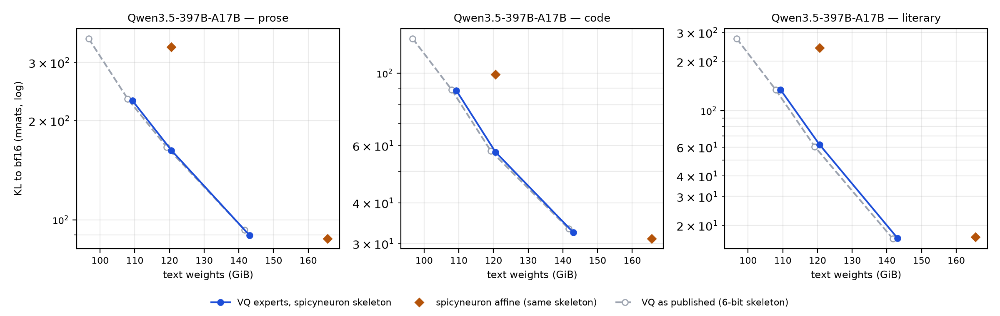
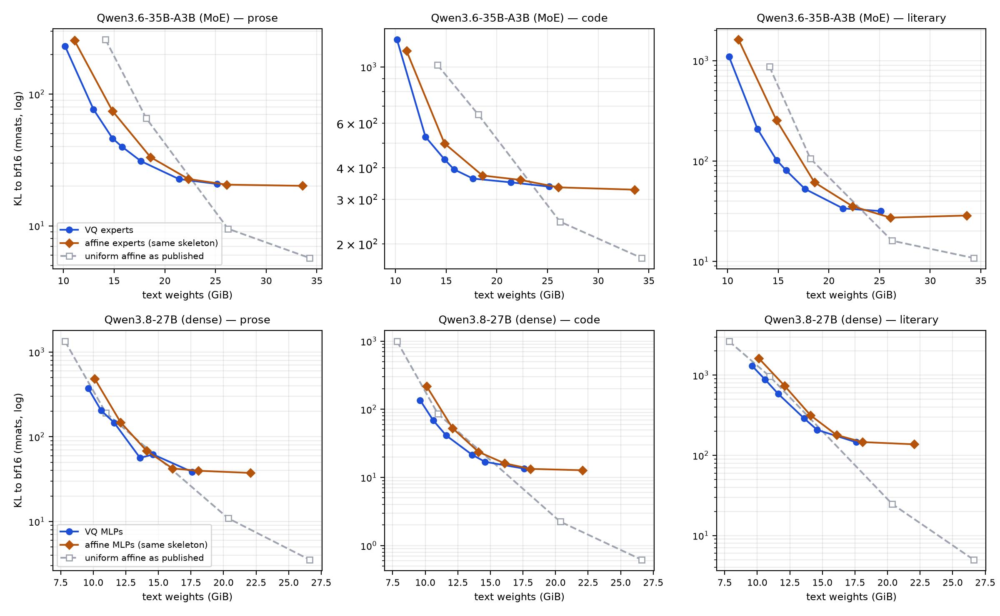

# Data-Free Vector Quantization Beats Affine Quantization at Matched Bytes Below 5 Bits

**Noah Zelezny**

*2026 · doi:[10.5281/zenodo.22119017](https://doi.org/10.5281/zenodo.22119017).
Every quality comparison holds the non-quantized skeleton byte-identical
between arms, is paired on identical token positions, and is read against
a measured fit-to-fit noise floor.*

## Abstract

Vector quantization (VQ) stores each group of d consecutive weights as an
index into a K-entry codebook fit by k-means to the weights themselves, at
log2(K)/d bits per weight, with no calibration data. We compare it against
data-free round-to-nearest affine quantization (group size 64, the quantizer
MLX ships) on three models: two mixture-of-experts models,
Qwen3.5-397B-A17B and Qwen3.6-35B-A3B, and one dense model, Qwen3.8-27B. Only the byte-dominant
tensors are quantized by the method under test — the routed experts, or the
dense model's feed-forward (MLP) layers — and every other tensor is byte-identical between the
two arms, so the quantizer is the only difference. Quality is exact
full-vocabulary KL divergence from the bf16 model, paired over the same
12,288 positions on each of three corpora, with cluster-robust t statistics
and a measured fit-to-fit noise floor for each model.

Below 5 bits per weight, at matched size (the two builds within 1 GiB),
VQ is never worse than affine on any corpus and is better on most. On the 397B, on the skeleton of
the leading community mixed-precision build, VQ experts at that 2.6-bit
build's exact size reduce divergence by 51% on prose, 42% on code and 74% on
literary text, and a VQ build 11.3 GiB smaller reduces it by 31%, 11% and
44%; at 3.1 bits a VQ build 22.5 GiB smaller than the 3.5-bit build matches it. On the 35B, at identical size,
VQ reduces divergence against 3-bit affine experts by 38%, 14% and 60%. On
the 27B, a VQ build 0.5 GiB smaller than one with 4-bit affine MLPs is better by 18% on prose
and 8% on literary text, with code within noise. From about 5.3 bits upward
the two quantizers tie on both models where that range was measured, in every
cell but one (35B literary text at 6.2 bits, where affine is better): each
reaches the floor set by the shared skeleton. Separately, a fitter change
that improves reconstruction of the largest-magnitude weights at identical
size degrades literary text by 35–60% on both MoE models while improving
code on one: a bulk reconstruction statistic did not rank these builds.
The VQ builds measured here are published with the Metal kernels that run
them. VQ is slower than affine at decode (§3.4).

## 1. Introduction

Whether a large language model runs locally is decided mainly by memory.
Compute per token is modest for models with few active parameters —
Qwen3.5-397B-A17B, the largest model studied here, activates 17 of its 397
billion parameters per token — but every weight must reside in RAM. At
16-bit precision the 397B model needs about 740 GiB, beyond any consumer or
workstation machine, and for the machines in question the decisive band is
2 to 6 bits per weight.

The quantizations available in this band on Apple Silicon are affine:
uniform builds from the mlx-community project, and mixed-precision builds
from the community at large, which keep attention and other structure above
the experts' width. Both are produced by MLX's round-to-nearest affine
quantizer, which, like the method studied here, uses no data. The
calibrated end of the affine family tunes its grids on data — GPTQ orders
quantization by approximate second-order information from a calibration set
[1], and AWQ scales channels by activation statistics [2]. Calibrated
methods, affine or vector, are outside the scope of this paper: the
comparator throughout is data-free round-to-nearest affine quantization.

Vector quantization of LLM weights is established in the CUDA ecosystem:
GPTVQ interleaves Hessian-guided VQ with updates to the remaining weights
[3], AQLM learns additive multi-codebook quantization on calibration data
with end-to-end fine-tuning [4], QuIP# combines incoherence processing with
E8 lattice codebooks [5], and VPTQ [12] and QTIP [13] extend vector and
trellis-coded quantization in the same calibration-based setting. None
publishes runnable artifacts for the Apple-Silicon MLX stack [8]; calibrated
VQ builds for MLX have since been published independently [9]. Non-uniform
scalar codebooks predate all of these: Deep Compression shares k-means
centroids within each layer and then retrains them [10], and SqueezeLLM
fits sensitivity-weighted k-means per channel on calibration data [11]. HQQ
is a data-free affine quantizer that optimizes each group's scale and
zero-point against the weights alone [14]. A codebook fit by k-means [6]
over fixed-length subvectors is the building block of product quantization
[7]. Here one codebook is shared by every subvector of a tensor, it is fit
to the weights alone, and nothing is retrained. The method is not new; the
contribution is its measurement against the quantizer it would replace,
with everything else held fixed.

**Notation.** A VQ geometry is written dN/KM, where N is the subvector
dimension and M the codebook size; builds in this paper range from d2/K16
to d4/K16384. For example, d4/K2048 groups weights into subvectors of 4
consecutive values and replaces each with an index into a 2048-entry
codebook, storing log2(2048)/4 = 2.75 bits per weight before scales. Every
size in this paper is the size of the text weights on disk: measured, except
for the affine comparators on our skeleton (§2.1), which were deleted after
scoring and whose sizes are computed from their tensor shapes, which fix an
affine build's size. Every quality number is measured on the assembled model.

**Claim 1 (method).** With the skeleton held byte-identical and the two
builds within 1 GiB of each other, data-free VQ of the byte-dominant tensors
is better than data-free round-to-nearest affine quantization of the same
tensors on at least one corpus, and worse on none, in every comparison from
2.6 to 4.7 bits per weight on all three models (§3). VQ builds much smaller
than their comparator are reported alongside: on the 397B they win or tie;
on the 35B a VQ build 1.9 GiB smaller is better on one corpus and ties the
other two, and on the 27B one 1.5 GiB smaller is worse on all three. From
about 5.3 bits per weight upward the two quantizers tie in every cell but
one (35B literary text at 6.2 bits, where affine is better). The advantage costs speed (§3.4).

**Claim 2 (measurement).** A fitter change that reduces reconstruction
error on the largest-magnitude weights, at identical size, moves output
quality (KL of the assembled model against its bf16 teacher) in opposite
directions on different corpora and different models (§4.3). In these
experiments neither mean nor tail-targeted reconstruction error ranked
output quality; only scoring the assembled model did.

## 2. Method

In the mixture-of-experts models the routed experts hold most of the
parameters — 97% in the 397B and 93% in the 35B; in the dense model the
same role is played by the MLP trio — the gate, up and down projections in
each transformer layer. These byte-dominant tensors are the quantization
target. Every other tensor — the *skeleton* — is quantized affinely or kept
at bf16, and is never varied within a comparison. The target tensors are
replaced by a vector quantization whose dial is the geometry (d, K), held
flat across every such tensor. A build is named by its geometry.

### 2.1 The skeleton and the matched comparison

The skeleton of every VQ build of the 397B and 35B, chosen by measurement
before any VQ build, is: 6-bit affine attention, shared experts, embeddings
and output head; the linear-attention input projections at 4-bit; and the
routers at bf16. The dense 27B builds put VQ MLPs into a 4-bit affine
conversion. The vision tower is kept at bf16 and excluded from every size
in this paper, as is the optional MTP draft head: sizes are text weights,
the bytes mlx-lm loads.

A comparison between two builds that differ in both quantizer and skeleton
measures two variables at once. Every primary comparison in §3 therefore
holds the skeleton byte-identical between the arms:

* **35B and 27B.** The affine comparator is the VQ build's own skeleton,
  tensor for tensor, with the target tensors quantized by MLX's
  round-to-nearest affine quantizer (group size 64) at 2, 3, 4, 5, 6 or 8
  bits. On the 27B the 4-bit comparator is identical in configuration to a
  uniform 4-bit conversion.
* **397B.** The comparators are the leading community builds, spicyneuron's
  2.6-bit and 3.5-bit [15], which share one skeleton: attention, shared
  experts, embeddings and output head at 8-bit, linear-attention input
  projections at 4-bit, routers at bf16, and routed experts at 2 and 3 bits
  respectively. Our VQ expert tensors are transplanted, bit for bit, onto
  that skeleton; the result differs from the community build only in how
  the experts are stored. Because that skeleton is 8-bit where ours is
  6-bit, our builds are 1.37 GiB larger on it than as published.

Comparisons against the published builds as they are distributed, with
their own skeletons, are reported separately in each section; there the
skeleton and the quantizer both differ.

### 2.2 The fit

For each target tensor independently: reshape the weights into
d-dimensional subvectors, scale each group of 64 by its maximum absolute
value, fit a K-entry codebook by k-means (k-means++ initialization, plain
Lloyd iterations), and store codes, scales and codebook. Two properties
matter downstream. Healthy reconstruction error scales with K — a fit at
K=128 sits near 0.46 relative error and a healthy K=2048 fit near 0.19 — so
acceptance thresholds are set per geometry. And the initialization
subsamples the weights stochastically, so two fits of the same tensor
differ; §2.6 measures the consequences and every comparison in this paper is
read against them.

Every build made for this paper uses exactly this fitter. The published
artifacts were fit with earlier versions of it and keep their original
codebooks:

| artifact | initialization | notes |
|---|---|---|
| 397B VQ-2.4bpw | random | first-generation fitter (2026-08-16) |
| 397B VQ-2.6bpw, VQ-3.1bpw | k-means++ (the default from 2026-08-18) | |
| 397B, all three artifacts, layers 57–59 | k-means++ | 9 of 180 expert modules refit in 2026-09 with scale–codebook alternation (Appendix A) |
| 35B VQ-3.8bpw | k-means++ | |
| 35B VQ-3.4bpw, VQ-4.6bpw, VQ-5.4bpw | not recorded | |
| 27B VQ-3.9bpw, VQ-4.5bpw | k-means++ | unseeded |
| 27B VQ-4.8bpw | k-means++ | seeded |

All use max-abs scales per group of 64. Differences between fitter versions
are bounded, together with draw-to-draw spread, by the floors of §2.6, which
compare a fresh fit with the current fitter against a published original.

### 2.3 Packing

Codes are packed to their true bit-width after fitting; packing is
bit-exact, verified at the logit level. Byte-aligned code widths are
stored directly (packing them saves nothing and costs decode speed).
All VQ sizes are packed sizes measured on disk, and a row's size and its
quality always come from the same artifact.

### 2.4 Sizes

A build's size follows from its geometry — log2(K)/d bits per code, plus
scales and the skeleton — and is predicted before the fit by a
two-coefficient size model; 12 of 13 out-of-sample predictions across the
three models landed within 0.4 GiB, and the thirteenth within its stated
band. Builds that mix geometries across layers are published (the 35B
VQ-4.6bpw uses d4/K2048 in the first 10 layers and d2/K512 after) but are
not points on the uniform ladders of §3.

### 2.5 The pipeline

Every build passes, in order: fit → reconstruction-error check → pack →
merge into the base checkpoint → structural verification → generation of a
test output through the exact runtime the artifact ships with → scoring. The
generation step is necessary: scoring exercises a prefill-shaped code path
while serving exercises the fused decode kernels, and an artifact can score
normally while being unable to serve.

### 2.6 Instruments and noise floors

**KL divergence**, reported in millinats (mnats), measures how far the
quantized model's next-token probability distribution drifts from the
full-precision model's, averaged over a fixed token stream; a millinat is
a thousandth of a nat, the unit of information in the natural logarithm.
Zero means identical behavior. **Top-1 agreement** is the fraction of
positions at which the two models' most probable tokens match.
**Relative reconstruction error (relerr)** — the norm of the difference
between a tensor and its reconstruction, relative to the tensor's norm — is
used only as a corruption check (§4.3).

**One instrument for every model.** Each unquantized bf16 model — the
*teacher* — is run once over three fixed corpora, 12,288 tokens each in
chunks of 512, and its full log-probability distribution over the
248,320-token vocabulary is cached at every position. The 397B teacher does
not fit in memory on any machine available to us, so it is streamed layer by
layer from disk for this one pass. Every quantized build is scored against
those caches: exact KL over the full vocabulary, and top-1 agreement, at the
same 36,864 positions. Scoring is deterministic — an artifact reproduces its
KL to every printed digit — and one scoring path and batching is used
throughout.

**Paired, cluster-robust comparison.** Because every build of a model sees
the same positions against the same cached teacher, two builds are compared
by their per-position difference. Positions within a 512-token chunk are
correlated, so the t statistic is computed over the 24 chunk means of that
difference (23 degrees of freedom; |t| > 2.07 is p < 0.05, two-sided). Every
t in this paper is this chunk-level statistic.

**Three corpora, reported separately.** *Prose* is the first 12,288 tokens
of a WikiText-2 excerpt of Wikipedia articles. *Code* is six source files
from the MLX framework at v0.30.0, in Python, Metal and C++. *Literary* is
the opening chapters of Jane Austen's *Pride and Prejudice* (the first
12,288 tokens of a corpus file of ten public-domain excerpts). The three are
reported separately because the same pair of builds can rank differently on
different kinds of text (§4.3), and a pooled mean is dominated by whichever
corpus diverges most. All three are public and plausibly present in the
models' training data; that shifts the level of every KL but does not bias
comparisons paired on identical positions.

Perplexity is not used to rank. It measures a model against the text rather
than against the model it approximates: on the 27B, prose perplexity is
lower for the uniform 4-bit build (5.683) than for 6-bit (5.965) and 8-bit
(5.947), whose KL is 6× and 20× smaller.

**Noise floors.** Two fits of identical geometry differ, because k-means
initialization draws a random subsample. For each model an independent
second fit of one geometry, made with the current fitter, is scored paired
against the original:

| model | geometry | prose | code | literary |
|---|---|---|---|---|
| 27B | d2/K256 | +0.1% (t +0.0) | +2.3% (+0.9) | +3.4% (+2.5) |
| 35B | d2/K1024 | +0.7% (+0.4) | +0.2% (+0.1) | −5.8% (−0.9) |
| 397B | d4/K128 | +1.4% (+0.9) | +5.2% (+2.1) | −2.7% (−1.0) |

*Original minus second fit. The originals keep the fitter version they were
built with (§2.2), so each floor bounds draw-to-draw and fitter-version
spread together.*

The floors reach |t| = 2.5 and 5.8%. A difference is claimed only where
|t| exceeds 2.5 and the margin exceeds the floor for its model; anything
less is reported as a tie. The fitter is seeded by default (seed 1234);
most published artifacts predate that default and are single unseeded
draws.

## 3. Results

### 3.1 Geometry: what d and K buy

At matched code rate, builds within 6 MB of each other in size (d4 minus d2,
negative = d4 better):

| code rate | pair | prose | code | literary |
|---|---|---|---|---|
| 2.00 bpw (35B) | d4/K256 vs d2/K16 | −14.6% (t −8.0) | −16.6% (−5.7) | −13.0% (−8.5) |
| 3.00 bpw (27B) | d4/K4096 vs d2/K64 | −3.5% (−1.8) | −14.2% (−4.0) | −10.7% (−7.4) |

Dimension pays at matched rate on five of six corpus-model pairs, by
11–17%; the sixth is a tie. d4 has a rate ceiling of 4.0 bpw (16-bit
indices over 4 weights), so the high bands belong to d2. Codebook size pays
with steep diminishing returns: on the 35B, d4 at K2048, K8192 and K16384
scores 76.6, 46.1 and 39.8 mnats of prose KL. Large codebooks also outgrow
Apple's 32 KB threadgroup memory — a d4 codebook above K = 2048, a d2
codebook above K = 4096 — and are then served from device memory, a
slower path.

### 3.2 The 397B

The published VQ builds of this model use uniform d4 across all 60 layers,
on the skeleton of §2.1. For the primary comparison their expert tensors
are placed on spicyneuron's skeleton (§2.1). KL in mnats; bpw is text bytes
over the model's 396.35 billion text parameters.

**Matched skeleton (spicyneuron's):**

| build | experts | GiB | bpw | prose | code | literary | prose top-1 |
|---|---|---|---|---|---|---|---|
| VQ d4/K256 | VQ-2.4bpw's | 109.3 | 2.37 | 229.8 | 88.4 | 134.3 | 86.4% |
| VQ d4/K512 | VQ-2.6bpw's | 120.6 | 2.61 | 162.4 | 57.3 | 62.2 | 88.8% |
| spicyneuron 2.6-bit | affine 2-bit | 120.6 | 2.61 | 333.9 | 99.2 | 241.1 | 83.5% |
| VQ d4/K2048 | VQ-3.1bpw's | 143.1 | 3.10 | 89.8 | 32.4 | 16.7 | 92.1% |
| spicyneuron 3.5-bit | affine 3-bit | 165.6 | 3.59 | 87.7 | 31.0 | 17.0 | 91.8% |

| VQ build | vs | prose | code | literary |
|---|---|---|---|---|
| d4/K512, same size | 2.6-bit | −51.4% (t −6.1) | −42.3% (−6.1) | −74.2% (−21.0) |
| d4/K256, 11.3 GiB smaller | 2.6-bit | −31.2% (−5.3) | −10.9% (−3.6) | −44.3% (−15.1) |
| d4/K2048, 22.5 GiB smaller | 3.5-bit | +2.4% (+0.7) | +4.4% (+0.5) | −1.5% (−0.1) |

At the 2.6-bit build's exact size VQ experts reduce divergence on every
corpus by 42–74%, and a VQ build 11.3 GiB smaller still reduces it by 11–44%. Against the 3.5-bit
build the result is a tie on all three corpora at 14% fewer bytes. Top-1
agreement moves with KL wherever a difference is claimed. No affine build above 3.5 bits was
scored on this model (§6).

**As published.** The published VQ builds carry the 6-bit skeleton of §2.1:

| build | release | GiB | bpw | prose | code | literary | prose top-1 |
|---|---|---|---|---|---|---|---|
| d4/K128 | — | 96.7 | 2.10 | 354.4 | 127.8 | 275.0 | 82.2% |
| **d4/K256** | **VQ-2.4bpw** | 108.0 | 2.34 | 232.7 | 89.0 | 134.1 | 86.4% |
| **d4/K512** | **VQ-2.6bpw** | 119.2 | 2.58 | 166.1 | 57.8 | 60.4 | 88.5% |
| **d4/K2048** | **VQ-3.1bpw** | 141.7 | 3.07 | 93.0 | 33.3 | 16.6 | 91.7% |

*Bold rows are published under `TheDrainFlorist/Qwen3.5-397B-A17B-<release>`.
Release names were set at release under an earlier size accounting and run
above the measured text bpw on all three models; VQ-2.4bpw also lost 2.8 GiB
in a later correction (Appendix A). The
bpw figure counts codes, scales and skeleton together; the d4/K2048 codebook
rate alone is 2.75 bits per quantized weight.*

Against spicyneuron's builds as distributed: VQ-2.4bpw, 12.6 GiB smaller
than the 2.6-bit build, −30% prose (t −5.1), −10% code (−3.2), −44%
literary (−15.9); VQ-2.6bpw, 1.4 GiB smaller, −50% (−6.0), −42% (−6.0), −75%
(−21.3); VQ-3.1bpw against the 3.5-bit build, 23.9 GiB smaller, +6% prose
(+1.6), +7% code (+0.8), −2% literary (−0.2), a tie. Moving the VQ experts
from the 6-bit to the 8-bit skeleton changes KL by at most 3.5% on any
corpus. The d4/K128 build, 23.9 GiB smaller than the 2.6-bit build, is worse
on all three corpora: +6% prose (+2.9), +29% code (+7.6), +14% literary
(+4.7).

### 3.3 The 35B MoE and the dense 27B

Sizes, bpw and KL on the same basis: text weights over 34.66B (35B) and
26.90B (27B) text parameters.

**35B, matched skeleton (§2.1: 6-bit structure, bf16 routers):**

| build | GiB | bpw | prose | code | literary | prose top-1 |
|---|---|---|---|---|---|---|
| VQ d2/K16 | 10.14 | 2.51 | 231.9 | 1283.8 | 1095.8 | 81.0% |
| affine 2-bit experts | 11.08 | 2.75 | 255.6 | 1159.8 | 1621.0 | 80.5% |
| **VQ d4/K2048** (VQ-3.4bpw) | 12.96 | 3.21 | 76.6 | 529.1 | 208.0 | 89.4% |
| **VQ d4/K8192** (VQ-3.8bpw) | 14.84 | 3.68 | 46.1 | 430.8 | 101.9 | 91.4% |
| affine 3-bit experts | 14.83 | 3.68 | 74.5 | 498.5 | 254.3 | 89.2% |
| VQ d4/K16384 | 15.78 | 3.91 | 39.8 | 393.1 | 80.5 | 92.2% |
| VQ d2/K256 | 17.64 | 4.37 | 31.0 | 361.8 | 52.6 | 93.2% |
| affine 4-bit experts | 18.58 | 4.60 | 33.2 | 372.1 | 61.2 | 92.8% |
| **VQ d2/K1024** (VQ-5.4bpw) | 21.39 | 5.30 | 22.6 | 349.6 | 33.7 | 94.0% |
| affine 5-bit experts | 22.33 | 5.53 | 22.7 | 357.5 | 35.4 | 93.8% |
| VQ d2/K4096 | 25.15 | 6.23 | 20.8 | 336.4 | 31.7 | 94.2% |
| affine 6-bit experts | 26.08 | 6.46 | 20.5 | 334.1 | 27.2 | 94.2% |
| affine 8-bit experts | 33.58 | 8.32 | 20.1 | 327.1 | 28.6 | 94.2% |

*Bold rows are published under `TheDrainFlorist/Qwen3.6-35B-A3B-<release>`.*

| VQ build | vs affine experts | prose | code | literary |
|---|---|---|---|---|
| d4/K8192, same size | 3-bit | −38.1% (t −10.7) | −13.6% (−3.8) | −59.9% (−16.2) |
| d4/K2048, 1.9 GiB smaller | 3-bit | +2.8% (+1.5) | +6.1% (+2.1) | −18.2% (−6.2) |
| d2/K256, 0.9 GiB smaller | 4-bit | −6.8% (−3.1) | −2.7% (−1.0) | −14.0% (−2.2) |
| d2/K1024, 0.9 GiB smaller | 5-bit | −0.0% (−0.0) | −2.2% (−0.8) | −4.8% (−1.0) |
| d2/K4096, 0.9 GiB smaller | 6-bit | +1.2% (+0.8) | +0.7% (+0.3) | +16.2% (+2.51) |

At the same 14.8 GiB, VQ reduces divergence against 3-bit affine experts by
14–60% on every corpus. At 4.4 bits VQ is better on prose and ties on the
other two. From 5.3 bits upward the two quantizers tie in every cell but
one: on literary text VQ at 6.2 bits is worse than 6-bit affine experts
(+16%, t 2.51), just past the claim threshold. The 8-bit affine
experts score 20.1 mnats on prose and VQ at 6.2 bits 20.8, so what remains above
5 bits is set mostly by the skeleton, not the expert quantizer.

Code KL is an order of magnitude higher on the 35B than on the other two
models for every quantization, including 8-bit experts. The mean is
dominated by a heavy tail of positions; every claimed difference on code
holds for the median as well as the mean.

**Uniform builds.** Uniform conversions quantize every linear layer,
including attention and the routers, at one width:

| build | GiB | bpw | prose | code | literary | prose top-1 |
|---|---|---|---|---|---|---|
| uniform q3 | 14.14 | 3.50 | 259.8 | 1018.3 | 868.4 | 77.6% |
| uniform q4 | 18.17 | 4.50 | 65.4 | 647.8 | 105.6 | 88.9% |
| uniform q6 | 26.23 | 6.50 | 9.5 | 244.4 | 16.0 | 96.1% |
| uniform q8 | 34.30 | 8.50 | 5.7 | 175.5 | 10.8 | 97.0% |

*q4 and q8 are configuration-identical to the mlx-community conversions; q3
and q6 are ours, by the same converter.*

Against these builds VQ-3.8bpw, 3.3 GiB smaller than q4, is −30% on prose
(t −14.3), −33.5% on code (−6.6) and ties on literary (−3.5%, −0.7), and
d2/K256, 0.5 GiB smaller than q4, is −53% (−20.7), −44% (−8.1), −50%
(−11.9). Most of that margin is skeleton: 4-bit experts on our skeleton
score 33.2 mnats on prose against uniform q4's 65.4. Above 5 bits the
uniform builds are better — q6 has less than half the prose KL of
VQ-5.4bpw. The only tensors uniform q6 stores more finely than our skeleton
are the linear-attention input projections, at 6 bits against 4.

**27B, matched skeleton (4-bit affine everything but the MLPs):**

| build | GiB | bpw | prose | code | literary | prose top-1 |
|---|---|---|---|---|---|---|
| affine 2-bit MLPs | 10.11 | 3.23 | 485.1 | 217.1 | 1629.2 | 72.5% |
| VQ d4/K1024 | 10.61 | 3.39 | 204.2 | 68.8 | 879.5 | 83.0% |
| **VQ d4/K4096** (VQ-3.9bpw) | 11.61 | 3.71 | 146.6 | 41.2 | 584.3 | 86.0% |
| affine 3-bit MLPs | 12.10 | 3.86 | 148.2 | 52.7 | 736.0 | 85.4% |
| **VQ d2/K256** (VQ-4.5bpw) | 13.60 | 4.34 | 56.3 | 21.5 | 289.2 | 90.9% |
| affine 4-bit MLPs | 14.09 | 4.50 | 68.5 | 23.7 | 315.6 | 90.5% |
| **VQ d2/K512** (VQ-4.8bpw) | 14.59 | 4.66 | 61.8 | 16.9 | 208.1 | 91.1% |
| affine 5-bit MLPs | 16.09 | 5.14 | 42.3 | 16.1 | 179.0 | 92.1% |
| VQ d2/K4096 | 17.58 | 5.61 | 38.6 | 13.5 | 145.9 | 92.6% |
| affine 6-bit MLPs | 18.08 | 5.77 | 39.7 | 13.3 | 146.3 | 92.7% |
| affine 8-bit MLPs | 22.06 | 7.04 | 37.4 | 12.7 | 137.2 | 92.7% |

*Bold rows are published under `TheDrainFlorist/Qwen3.8-27B-<release>`. The
4-bit row is configuration-identical to a uniform 4-bit conversion.*

| VQ build | vs affine MLPs | prose | code | literary |
|---|---|---|---|---|
| d4/K4096, 0.5 GiB smaller | 3-bit | −1.1% (t −0.4) | −21.8% (−6.0) | −20.6% (−18.3) |
| d4/K1024, 1.5 GiB smaller | 3-bit | +37.8% (+9.5) | +30.6% (+4.0) | +19.5% (+15.4) |
| d2/K256, 0.5 GiB smaller | 4-bit | −17.8% (−5.5) | −9.2% (−2.1) | −8.3% (−5.1) |
| d2/K512, 0.5 GiB larger | 4-bit | −9.7% (−3.8) | −28.5% (−4.4) | −34.1% (−23.2) |
| d2/K4096, 0.5 GiB smaller | 6-bit | −2.9% (−0.7) | +0.9% (+0.8) | −0.3% (−0.3) |

The result is not specific to mixture-of-experts models. Within 0.5 GiB,
VQ is better on two or three corpora and ties on the rest at 3.7, 4.3 and
4.7 bits per weight, and ties 6-bit MLPs at 5.6. The d4/K1024 build, 1.5 GiB
smaller than the 3-bit comparator, is worse on every corpus. As on the 35B,
the affine builds flatten above 5 bits — 8-bit MLPs reach 37.4 on prose,
against 3.5 for a uniform 8-bit conversion — at the floor set by the 4-bit
skeleton.

Against uniform conversions, which for this model share our 4-bit skeleton
at 4 bits but not at other widths: uniform q3 (10.96 GiB) scores 192.4,
86.3 and 965.1, and VQ-3.9bpw, 0.65 GiB larger, is −24% (t −8.0), −52%
(−9.8) and −39.5% (−39.6) against it; uniform q6 and q8 (20.36 and 26.62 GiB)
score 10.9 and 3.5 on prose, below every build on the 4-bit skeleton.

### 3.4 Runtime performance and kernel support

None of this serves without custom Metal kernels: a fused
decode-and-matmul path that reads codes and codebook directly (per-K
bit-width extraction in-kernel), a device-memory codebook variant for the
codebooks that exceed Apple's 32 KB threadgroup memory, and a path that
feeds codes stored at a whole number of bytes straight to the packed kernel
without first copying them (bit-exact; prefill throughput 1.33× what it was
before). All kernel variants are accepted only on bit-identity
with a reference path where both load, and on relative error against a
float32 reference where only one does.

Speed against affine was measured on the 35B: the d2/K256 build (17.64 GiB)
against uniform q4 (18.17 GiB), a 2,048-token prompt, one fresh process per
arm, three alternating runs each in one session on an idle Apple M3 Ultra,
with the VQ runtime of the scored builds. VQ decoded at 0.77× and prefilled
at 0.86× the affine build's throughput (medians; runs 0.73–0.78 and
0.78–0.88). Kernel and runtime design has moved these ratios substantially (the
copy-free path above alone made prefill 1.33× faster), and how far further kernel
work can close the gap is not known; the ratios describe the cost's size
with this runtime, not a fixed property of the method. Only same-session
ratios are reported: decode throughput at ~100 GiB residency was bimodal on
our hardware, so no absolute throughput is published.
Three further kernel changes — fused row-gather, byte-aligned packing and
native-bf16 kernels — each gave no speedup or a slowdown.

## 4. Negative results

### 4.1 Above 5 bits

Above about 5.3 bits per weight the two quantizers of the target tensors
tie in every cell but one (§3.3; 35B literary text at 6.2 bits, where affine
is better), and on both smaller models 8-bit affine experts or MLPs are
within 6.2% of 6-bit on every corpus: what remains is the skeleton's.

### 4.2 Dimension above 3 bits

Whether d4 still beats d2 at d4's 4.0 bpw ceiling is untested. The only d4
geometry at that rate uses a 65,536-entry codebook, sixteen times the 32 KB
threadgroup limit, and was not built.

### 4.3 Reconstruction error did not rank output quality

A refit of the published 397B VQ-2.4bpw at its own geometry (d4/K256,
byte-identical size) has *lower* mean reconstruction error on every
projection and ties the original as a model: +3.9% prose (t +1.7), −4.7%
code (−1.7), −4.8% literary (−1.0). Percentile analysis of the weights
locates the trade: the refit is better where most weights live and worse in
the top 0.1% by magnitude, and mean reconstruction error reports the trade
as an improvement.

Reweighting the k-means objective toward that tail (weights ∝ |w|^4, body
layers only) does what it is built to do in weight space: on one 35B module
it cuts relative error on the top 0.1% of weights from 0.192 to 0.110, at a
mean-error cost of 0.313 → 0.374. Each pair below is built twice with the
same fitter, seed and byte-identical size, differing only in this
weighting:

| model | corpus | unweighted | tail-weighted | Δ | t |
|---|---|---|---|---|---|
| 397B, d4/K256 | prose | 241.8 | 279.1 | +15.5% | +3.7 |
| | code | 84.7 | 84.3 | −0.5% | −0.1 |
| | literary | 127.6 | 171.8 | +34.7% | +8.3 |
| 35B, d4/K256 | prose | 198.1 | 227.7 | +14.9% | +5.3 |
| | code | 1070.1 | 961.5 | −10.1% | −4.4 |
| | literary | 953.8 | 1521.8 | +59.6% | +27.9 |

*All expert modules refit. Weighting on layers ≥ 20 of 60 (397B) and ≥ 13
of 40 (35B).*

The same weight-space change leaves 397B code unchanged, improves 35B code
by 10%, and degrades literary text by 35–60% on both, far outside the
floors. In these experiments no single reconstruction statistic ordered the
builds, because their order depended on the model and the corpus.

## 5. Measurement discipline

A margin is claimed only where it exceeds the measured floor for its model
(§2.6). Every number in §3–4 comes from one instrument: each model was
scored in a single pinned environment, since changing the environment moves
KL on the same build by up to 0.3%. A row's size and quality come from the
same build. No build is treated as releasable until it
has generated tokens through the exact runtime it ships with. A published
artifact is identified by its pinned Hugging Face revision, and stored
metadata is verified against the bytes rather than trusted.

## 6. Limitations

**Comparator.** The affine comparator is data-free round-to-nearest; no
calibrated method, affine or vector, was scored, nor any data-free method
that optimizes the affine grid, such as HQQ [14]. On the 397B, the matched
comparison is on spicyneuron's skeleton, and no affine build above 3.5 bits
was scored: at ~225 GB for 4-bit and ~320 GB for 6-bit, such builds exceed
the memory of any machine available to this project.

**Coverage.** Three models from one vendor family, one of them dense.
Single software stack (MLX/Metal) and one hardware platform; the kernel
conclusions, including threadgroup capacity, are specific to Apple Silicon.
Quality is measured by KL to the teacher on three 12,288-token corpora, not
by downstream task benchmarks.

**Instrument.** The chunk-level t captures variation across token positions,
not across fits; fit-to-fit variation enters only through the noise floor,
which is a single pair of fits at one geometry per model and so has no
variance estimate of its own. No correction for multiple comparisons is
applied. The headline margins (|t| 5–23, 30–75%) are far outside both, but
three claimed differences sit within twice their model's floor: 35B d2/K256
on prose (−6.8% against a 5.8% floor) and 27B d2/K256 on literary and d2/K512
on prose (−8.3% and −9.7% against 3.4%). A tie is a failure to find a
difference, not a demonstration of equivalence. Above 5 bits
the comparison measures the skeleton as much as the quantizer. Decode
throughput was bimodal at ~100 GiB residency and is uncharacterized at
other sizes; speed was measured on one pair of builds at one prompt length.

**Costs.** VQ is slower than affine: on the 35B, about three quarters of the
decode throughput of a similar-size affine build (§3.4).

## 7. Reproducibility

All artifacts are published under `TheDrainFlorist` on Hugging Face with
their VQ runtimes bundled in-checkpoint: they load in stock mlx-lm,
unpatched, with `trust_remote_code=True`. Where a repository's weights were
upgraded in place, the previous build remains fetchable at its pinned
revision. The scored revisions (Hugging Face commit, first 12 characters):

| artifact | revision |
|---|---|
| TheDrainFlorist 397B VQ-2.4bpw / 2.6bpw / 3.1bpw | bb4887a06bee / ea58bf237b06 / f2c22ab5988e |
| TheDrainFlorist 35B VQ-3.4bpw / 3.8bpw / 5.4bpw | c19d1e56736b / 73a8b39d2dbd / 7f86f33f2c44 |
| TheDrainFlorist 27B VQ-3.9bpw / 4.5bpw / 4.8bpw | 30c2147f3faa / f1805e61893d / f85736b073cc |
| spicyneuron 397B 2.6-bit / 3.5-bit [15] | dc77505e97a4 / 16a9eaf13095 |

Later revisions of the three 397B repositories repack their weights; the
revisions above are the ones scored. Most published fits are unseeded single draws (§2.2):
reproducible in recipe and geometry, not bit-for-bit. Every build made for
this paper is seeded.

Every VQ score in this paper was produced with the v2 runtime profile, in
which the VQ kernels take and return bf16. Published artifacts carry either
this profile or the earlier v1.5 profile, which differs only in those two
input/output settings; on the rows rescored both ways, the two profiles
agree within 2% KL. Each scored copy generated tokens through its bundled
runtime. The matched-skeleton builds were made with two published tools:
`vqlab stream-convert --skeleton-from` (affine target tensors on a given
build's skeleton) and `vqlab reskeleton` (one build's target tensors on
another's skeleton, copied bit for bit). Fit, pack, verification and
scoring tools, and the script that generates every table in this paper from
the saved per-position arrays, are published in the project repository,
**VQLab** ([github.com/noahzelezny/VQLab](https://github.com/noahzelezny/VQLab),
Apache-2.0). All three evaluation corpora ship with it, each with a record
of its source, license and exact contents. Nothing was fit on data, so
there is no train/eval overlap to disclose.

## References

[1] E. Frantar, S. Ashkboos, T. Hoefler, D. Alistarh. *GPTQ: Accurate
Post-Training Quantization for Generative Pre-trained Transformers.*
ICLR 2023. [arXiv:2210.17323](https://arxiv.org/abs/2210.17323).

[2] J. Lin, J. Tang, H. Tang, S. Yang, W.-M. Chen, W.-C. Wang, G. Xiao,
X. Dang, C. Gan, S. Han. *AWQ: Activation-aware Weight Quantization for
On-Device LLM Compression and Acceleration.* MLSys 2024.
[arXiv:2306.00978](https://arxiv.org/abs/2306.00978).

[3] M. van Baalen, A. Kuzmin, I. Koryakovskiy, M. Nagel, P. Couperus,
C. Bastoul, E. Mahurin, T. Blankevoort, P. Whatmough. *GPTVQ: The
Blessing of Dimensionality for LLM Quantization.* 2024.
[arXiv:2402.15319](https://arxiv.org/abs/2402.15319).

[4] V. Egiazarian, A. Panferov, D. Kuznedelev, E. Frantar, A. Babenko,
D. Alistarh. *Extreme Compression of Large Language Models via Additive
Quantization.* ICML 2024.
[arXiv:2401.06118](https://arxiv.org/abs/2401.06118).

[5] A. Tseng, J. Chee, Q. Sun, V. Kuleshov, C. De Sa. *QuIP#: Even
Better LLM Quantization with Hadamard Incoherence and Lattice
Codebooks.* ICML 2024. [arXiv:2402.04396](https://arxiv.org/abs/2402.04396).

[6] S. Lloyd. *Least Squares Quantization in PCM.* IEEE Transactions on
Information Theory 28(2):129–137, 1982.

[7] H. Jégou, M. Douze, C. Schmid. *Product Quantization for Nearest
Neighbor Search.* IEEE Transactions on Pattern Analysis and Machine
Intelligence 33(1):117–128, 2011.

[8] A. Hannun, J. Digani, A. Katharopoulos, R. Collobert. *MLX:
Efficient and Flexible Machine Learning on Apple Silicon.* Software, 2023.
[github.com/ml-explore/mlx](https://github.com/ml-explore/mlx).

[9] aquaman164. *Qwen3.6-35B-A3B-MLX-VQ* (2.4, 2.6 and 3.4 bpw builds).
Software, Hugging Face, 2026.
[huggingface.co/aquaman164](https://huggingface.co/aquaman164).

[10] S. Han, H. Mao, W. J. Dally. *Deep Compression: Compressing Deep
Neural Networks with Pruning, Trained Quantization and Huffman Coding.*
ICLR 2016. [arXiv:1510.00149](https://arxiv.org/abs/1510.00149).

[11] S. Kim, C. Hooper, A. Gholami, Z. Dong, X. Li, S. Shen, M. W. Mahoney,
K. Keutzer. *SqueezeLLM: Dense-and-Sparse Quantization.* ICML 2024.
[arXiv:2306.07629](https://arxiv.org/abs/2306.07629).

[12] Y. Liu, J. Wen, Y. Wang, S. Ye, L. L. Zhang, T. Cao, C. Li, M. Yang.
*VPTQ: Extreme Low-bit Vector Post-Training Quantization for Large Language
Models.* EMNLP 2024. [arXiv:2409.17066](https://arxiv.org/abs/2409.17066).

[13] A. Tseng, Q. Sun, D. Hou, C. De Sa. *QTIP: Quantization with Trellises
and Incoherence Processing.* NeurIPS 2024.
[arXiv:2406.11235](https://arxiv.org/abs/2406.11235).

[14] H. Badri, A. Shaji. *Half-Quadratic Quantization of Large Machine
Learning Models.* Technical report, 2023.
[mobiusml.github.io/hqq_blog](https://mobiusml.github.io/hqq_blog/).

[15] spicyneuron. *Qwen3.5-397B-A17B-MLX-2.6bit* and
*Qwen3.5-397B-A17B-MLX-3.5bit.* Software, Hugging Face, 2026.
[huggingface.co/spicyneuron](https://huggingface.co/spicyneuron).

## Appendix A. Changes from earlier versions

Versions 1–4 of this paper were deposited at the DOI above. Version 5
differs as follows.

* **Matched skeleton.** Earlier versions compared VQ builds against
  affine builds whose skeletons differed from ours, so each margin combined
  a skeleton difference with the quantizer difference. On the 35B, most of
  the reported advantage over uniform q4 was skeleton (§3.3). Every primary
  comparison now holds the skeleton byte-identical (§2.1), and the title's
  bound moves from 6 bits to 5, above which the matched comparisons tie in
  every cell but one, where affine is better.
* **Instrument.** KL is now exact over the full 248,320-token vocabulary;
  version 4 used a top-64 approximation. Significance is now the chunk-level
  t over 24 chunk means (§2.6); version 4 reported a per-position t, which
  overstates confidence.
* **397B layers 57–59.** The version 4 rows for d4/K128, d4/K256, d4/K512 and
  d4/K2048 were measured on builds whose expert modules in layers 57–59 (9 of
  180) were affine 3-bit rather than VQ. All 397B builds in this version are
  VQ in layers 0–59; the 9 replacement modules were fit with the
  scale-alternating fitter variant (§2.2). On the version 4 instrument, the
  correction changed prose KL by +0.28, +2.32, +4.94 and +12.96 mnats at
  d4/K2048, K512, K256 and K128. The same correction removed 2.8 GiB from
  VQ-2.4bpw after it was named, which is why it measures 2.34 bpw.
* **Withdrawn row.** The version 4 row labeled flat d8/K16384 (VQ-2.2bpw) was
  a mixed-geometry build and is not a point on the uniform ladder.
* **Sizes.** All sizes are text weights (tensors under `language_model.`),
  excluding the vision tower and the MTP draft head.
* **Removed claims.** The size-targeting claim of version 4 is reduced to
  §2.4, and the claim that reconstruction error cannot rank output quality
  is narrowed to the experiments of §4.3.

## Acknowledgments

The spicyneuron and mlx-community builds served as comparators
throughout; this work exists because those artifacts were public,
pinned, and worth measuring against. We hope ours are the same.

**AI disclosure.** This work is the product of several months of iterative
collaboration between the author and large language model agents (Anthropic
Claude, Opus- and Sonnet-class models). The agents operated the fitting,
packing, verification and scoring pipelines, proposed and implemented the
statistical analysis, and drafted the manuscript. The author conceived the
project, built and ran the lab every experiment used, and published the
artifacts. The author set the comparison design and scope, and over many
rounds challenged results, redirected the work and corrected claims. The
matched-skeleton requirement that reshaped this version's conclusions
(Appendix A) came from that process. Nothing here was produced in a single
pass. The author takes sole responsibility for the content. All quantitative
results come from the deterministic instruments of §2.6, and every table is
generated by script from saved per-position arrays.
