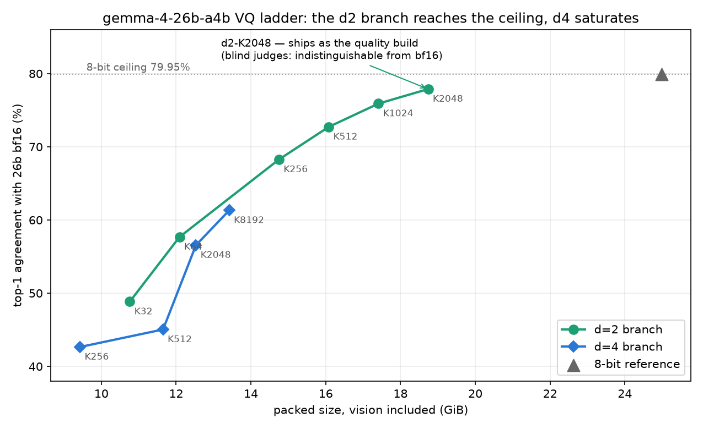

---
language:
- en
license: gemma
library_name: mlx
pipeline_tag: image-text-to-text
base_model: google/gemma-4-26b-a4b-it
base_model_relation: quantized
tags:
- mlx
- quantized
- vector-quantization
- apple-silicon
- gemma-4
- multimodal
---



# gemma-4-26b-a4b-it-VQ-6.2bpw

**18.7 GiB — indistinguishable from bf16 on blind literary judging, at 39% of bf16's size. Vision included.**

A vector-quantized build of
[gemma-4-26b-a4b-it](https://huggingface.co/google/gemma-4-26b-a4b-it) for
Apple Silicon. Stock `mlx-lm`, no patches — the VQ runtime ships inside the
checkpoint as `model.py`.

## Measured results

**Perplexity is NOT reported here, and that is deliberate.** Raw
loglikelihood is invalid on the gemma-4-it family — the RL-sharpened
distribution collapses, so wikitext ppl reads ~100-700 while the model
generates fluent prose. Verified independently against HF transformers on
unquantized bf16, so it is a model property, not an MLX artifact. Anyone
quoting gemma-4 perplexity is quoting noise.

Instead: **blind pairwise judging against bf16**, plus KL-to-bf16.

### Blind literary judging vs bf16 (the headline)

60 literary continuations, greedy. Pairs anonymized with A/B randomized per
pair and the key withheld from the judge (claude-sonnet-5), which was told
ties are legitimate. Exact two-sided sign test on decisive pairs.

| | bf16 preferred | this model preferred | tie | p |
|---|---|---|---|---|
| vs bf16 (48 GiB) | 11 | 23 | **26** | 0.058 |

**Statistically indistinguishable from bf16**, with the judge unable to
separate the texts in 43% of pairs. Read that as "indistinguishable", NOT
"better than bf16" — the judge showed a positional lean and bf16 sat in the
disfavoured slot, so the direction is not claimable.

For contrast, the same instrument on weaker builds of this model: a 12.5 GiB
d4 build lost 36-20 (p=0.044) and a 9.4 GiB build lost 34-12 (p=0.0016).
Both are *significantly* worse than bf16. This one is not.

### KL divergence to bf16

| build | size | mean KL (millinats/tok) | top-1 agreement |
|---|---|---|---|
| 8-bit reference | 25 GiB | 441 | 79.95% |
| **this model** | **18.7 GiB** | **537** | **77.89%** |
| 4-bit-class d4 build | 12.5 GiB | 1856 | 56.56% |

**80% is the practical ceiling here, not 100%.** This is a 128-expert MoE
with top-8 routing: any perturbation flips which experts fire, so even a
near-lossless 8-bit quant only reproduces bf16's argmax ~80% of the time.
Judge against the 8-bit row, never against 100%.

## Choosing a size (read this before downloading)

This artifact exists for one job: **bf16-class quality in the smallest
size that actually delivers it** (18.7 GiB; blind judges could not tell it
from bf16). Below this size, quantizing the 26B harder stops making sense
— we measured our own smaller 26B builds against
`mlx-community/gemma-4-e4b-it-8bit` across paired litbench, KL,
constraint benches, and a capability ladder, and the honest result is
that **at small sizes the e4b is the right model**: it matches or beats
aggressive 26B quants at similar or smaller size, and it is faster.

So the family guidance is:
- **~19 GiB budget, want bf16-class quality or long-form generation
  (2,500+ words sustained):** this artifact.
- **~8 GiB budget:** use `gemma-4-e4b-it-8bit` — not a compromise; it wins
  that bracket on our measurements.
- **Tighter than 8 GiB or RAM-bound:** our
  [VQ-PLE build of the e4b](https://huggingface.co/TheDrainFlorist/gemma-4-e4b-it-VQ-PLE)
  (7.39 GiB, measurably closer to bf16 than the 8-bit, 20% less RAM,
  ~8% slower decode and ~13.5% slower prefill) is the right pick when
  memory is the constraint and latency is not.

## Runtime

Measured on an M4 Max (128 GB), macOS, stock `mlx-lm`, GPU otherwise idle, 120-token greedy generation:

| | |
|---|---|
| peak memory | 17.7 GiB |
| decode | **~48 tok/s** |


Fits a 32 GB machine with room for context.

## Run it

```bash
pip install mlx-lm
python -m mlx_lm generate \
  --model TheDrainFlorist/gemma-4-26b-a4b-it-VQ-6.2bpw \
  --prompt "Continue this passage in Austen's voice: ..." \
  --max-tokens 400
```

Vision tower is grafted in (356 tensors, +1.07 GiB) and the text path is
bit-identical to the text-only build — verified by scoring both against the
same KL cache and getting identical numbers.

### Faster prefill (optional)

`VQ_DECODE_CHUNK=16` speeds up prefill ~20% (measured end-to-end on
the 397B artifact from the same runtime; smaller chunks are faster AND use
less memory — the auto-sizer's default of 32 is kept because it is the
smallest chunk that reproduces our published numbers bit-exactly). Set the
env var if you don't need bit-exact reproduction.

## How it was built

Experts are vector-quantized at **d=2, K=2048** (5.75 bits/weight packed);
everything else — attention, router, embeddings, the per-layer dense MLP —
stays at 8-bit. Experts are ~90% of the language model, so that is where the
bytes are.

d=2 matters: at d=4 every +0.25 bpw costs a codebook DOUBLING, so d4
saturates near 3.5 bpw and 61% agreement. Reaching this quality at d=4 would
need K=2^22. Halving d is the only way to spend enough bits to approach the
ceiling.

## Verification

Every tensor was decoded **from the published artifact** (not from a fit
log) and compared against the bf16 source; no tensor exceeds 3x the
artifact's own median reconstruction error. This caught real silent
corruption during development — a fit log reporting healthy error while the
written file held destroyed tensors — so it is a standing gate, not a
formality.


### Multi-machine (exo) note

These artifacts fit on one machine, but if you shard them across an
[exo](https://github.com/exo-explore/exo) cluster anyway, one guard is
required: VQ codebooks must **replicate rather than slice**. Stock exo
tensor parallelism slices them. This artifact's bundled `model.py` detects
that and fails loudly with an explanatory error (instead of silently
generating fluent garbage that reads as "a broken quant") — but it cannot
fix the sharding itself. To actually run tensor-parallel, apply
[exo PR #2268](https://github.com/exo-explore/exo/pull/2268) or run the
ready branch
[`noahzelezny/exo:vq-codebook-replicate`](https://github.com/noahzelezny/exo/tree/vq-codebook-replicate).
Single-machine mlx-lm and pipeline sharding are unaffected.

## Limitations

- **Do not benchmark this with perplexity.** See above.
- Top-1 agreement with bf16 is 77.89%, versus 79.95% for a 25 GiB 8-bit
  build. The blind judging says readers cannot tell, but the token-level
  divergence is real and larger than 8-bit's.
- Blind judging is one judge, one pass, n=60 with 26 ties — as few as 34
  decisive pairs. The ordering across builds is robust; the absolute margin
  is not tightly bounded.
- Audio is not included: this checkpoint ships zero audio tensors upstream.
