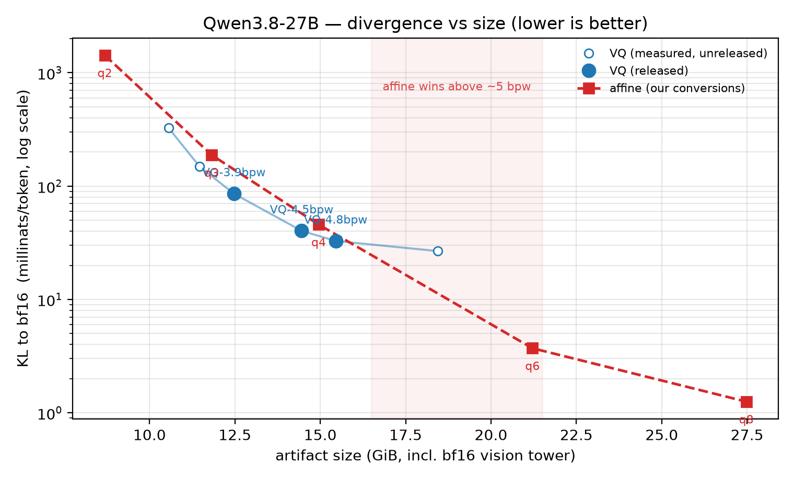

---
language:
- en
license: apache-2.0
library_name: mlx
pipeline_tag: text-generation
base_model: Qwen/Qwen3.8-27B
base_model_relation: quantized
tags:
- mlx
- quantized
- vector-quantization
- apple-silicon
- qwen3.8
---

# TheDrainFlorist/Qwen3.8-27B-VQ-4.8bpw

**15.5 GiB — the best quality here, and the only reproducible fit.**

A vector-quantized build of
[Qwen3.8-27B](https://huggingface.co/Qwen/Qwen3.8-27B) for Apple Silicon.
Stock `mlx-lm`, no patches — the VQ runtime ships inside the checkpoint as
`model.py`.

At the time of release no MLX-format quantization of this model had been
published, so the affine builds compared against below are our own
conversions rather than community artifacts. That is a weaker class of
evidence — a comparator you build yourself can be built badly, and one of
ours was; see Comparators.



## Measured results

Scored against the bf16 teacher on the same corpus with an unmodified
`mlx-lm`. All sizes include the 333-tensor bf16 vision tower (0.859 GiB),
carried by every build here.

| build | size | KL to bf16 (mnats/tok) | top-1 agreement | perplexity |
|---|---|---|---|---|
| affine q2 (ours) | 8.69 GiB | 1426.9 | 46.1% | 16.435 |
| affine q3 (ours) | 11.82 GiB | 187.8 | 79.5% | 5.832 |
| affine q4 (ours) | 14.95 GiB | 45.8 | 89.8% | 5.206 |
| **this model** | **15.45 GiB** | **32.8** | **90.8%** | 5.162 |
| affine q6 (ours) | 21.21 GiB | 3.71 | 96.8% | 5.260 |
| affine q8 (ours) | 27.48 GiB | 1.25 | 98.5% | 5.241 |
| bf16 | 51.7 GiB | 0 | 100% | — |

Against the 4-bit affine conversion this build is **28% closer to bf16**
(32.8 millinats against 45.8) and 1.0 point better on token agreement, for
3.3% more bytes. That margin is 6.2x this family's measured fit-to-fit noise
floor.

**This is the one fit in the collection that is seeded.** k-means used a fixed
seed, so the artifact is reproducible from its recipe rather than only in
recipe. It also ran three times the Lloyd iterations of its siblings from
bit-identical starting centroids, which makes it the more converged fit —
every metric moved the right way. We are *not* claiming it is measurably
better than the shorter run: the improvement is below our resolution, not
shown to be zero, and a card should not turn that into a result.

**Rank these by KL, not perplexity.** On this instruction-tuned family
perplexity barely moves — every build from 3-bit upward sits between 5.19 and
5.35, inside the measurement's own noise — while divergence from the teacher
moves by a factor of forty across the same range. Perplexity is an aggregate
over finite text and absorbs offsetting errors; KL measures distance to the
teacher's distribution directly.

## Runtime

**Not measured on this artifact.** No decode or prefill benchmark has been
run on this build, and quoting a sibling's figures would be a substitution
this project does not make. Resident memory is about 14.59 GiB — the disk
figure less the vision tower, which `mlx-lm` does not load.

Runs on a 24 GB, comfortably sized machine.

## Run it

```bash
pip install mlx-lm
python -m mlx_lm generate \
  --model TheDrainFlorist/Qwen3.8-27B-VQ-4.8bpw \
  --prompt "Explain vector quantization briefly." \
  --max-tokens 512
```

## How it was built

Vector quantization of the dense MLP trio at **d=2, K=512**. Each 2-weight
subvector stores one 9-bit index into a per-tensor 512-entry fp16 codebook. With an fp16 scale
per (row, 64 weights) that comes to 4.75 bits per weight over the quantized
surface; everything else in the model is 8-bit.

Every quantized tensor uses this one geometry: no depth schedule, no mixed
allocation.

**Codebooks are fit in pure weight space** — k-means over the weight
subvectors, no Hessian, no activation statistics, no calibration corpus.

**The fit is seeded**, so this artifact is reproducible bit-for-bit from its
recipe and seed. Margins are still quoted against the family's measured
fit-to-fit floor of 2.085 millinats, which was measured from unseeded draws.

## Comparators

The affine rungs above are local conversions made with `mlx_lm.convert`. One
correction worth stating plainly, because it was ours: the 8-bit comparator
originally used here was not a uniform 8-bit build at all — its configuration
declared a 4-bit default with per-module overrides, including the output head
at 6 bits. It was rebuilt with defaults and re-scored, and the figure above is
the rebuilt one. The bar moved *against* us when corrected, from 1.64 to 1.25
millinats.

## Where this stops paying

Above roughly 5 bits per weight the advantage reverses on this model: our
6-bit affine conversion reaches 3.7 millinats at 21.2 GiB, which no VQ rung we
measured approaches at that size. Builds larger than the ones released here
were measured and deliberately not published for that reason.

## Verification

Every tensor was decoded **from the published artifact** and compared against
the bf16 source; no tensor exceeds 3x the artifact's own median reconstruction
error. The bundled runtime was exercised as the executing copy in a stock
venv, not merely present in the folder. Vision tower grafted from the base
checkpoint and verified key-for-key against the official index, including the
channels-last patch-embedding layout that a naive rename gets silently wrong.

## Limitations

- Perplexity cannot rank builds on this family — see above.
- No throughput measurement, and no task-suite scores, for this artifact.
- The affine comparators are our own conversions, not community builds.
- Above ~5 bpw affine wins outright on this model; this collection stops
  below that line deliberately.
