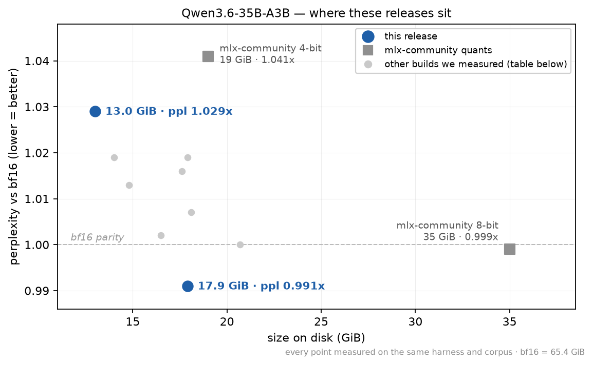
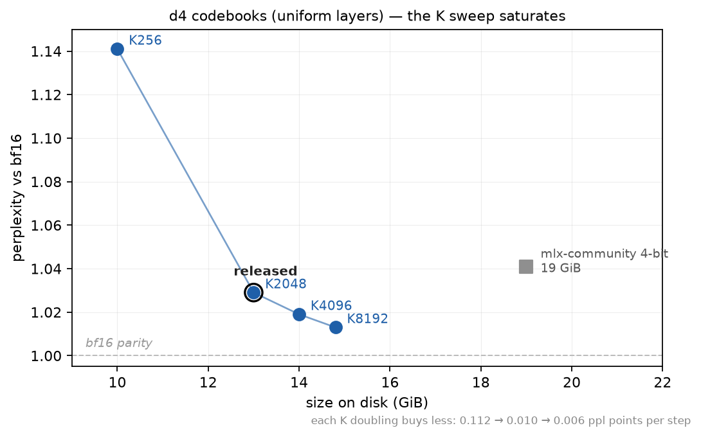
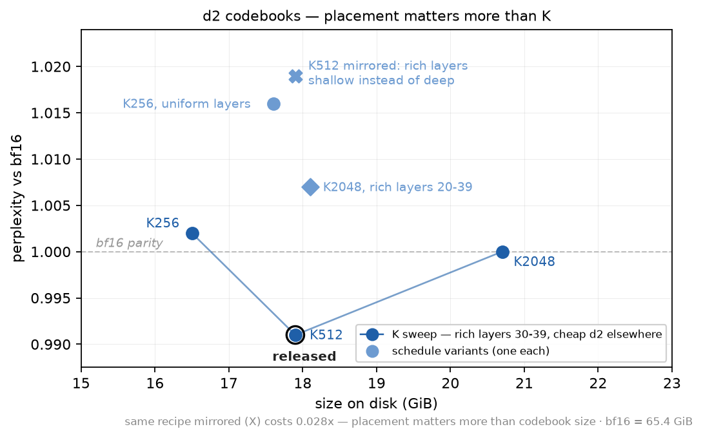

---
language:
- en
license: apache-2.0
library_name: mlx
pipeline_tag: text-generation
base_model: Qwen/Qwen3.6-35B-A3B
base_model_relation: quantized
tags:
- mlx
- quantized
- vector-quantization
- apple-silicon
- qwen3.6
---

# Qwen3.6-35B-A3B-VQ-4.6bpw

**Within 0.5% of bf16 perplexity on two corpora, and smaller than the community 4-bit.** 18.7 GiB (vision tower included): 0.991x on wikitext, 1.004x on code. The 8-bit holds 0.999x on both at 35 GiB; the 4-bit runs 1.041x / 1.046x at 19 GiB. Same harness, same files, every number. Runs on a 32 GB Mac.

A vector-quantized build of
[Qwen3.6-35B-A3B](https://huggingface.co/Qwen/Qwen3.6-35B-A3B) for Apple
Silicon. Stock `mlx-lm`, no patches.




## Measured results

Referee corpus, 2048-token windows, scored against the bf16 teacher on the
same files with an unmodified `mlx-lm`:

| build | size | perplexity | vs bf16 | top-1 agreement |
|---|---|---|---|---|
| bf16 | 65.4 GiB | 4.7215 | 1.000x | 100% |
| mlx-community 8-bit | 35 GiB | 4.7150 | 0.999x | 96.18% |
| **this model** | **18.7 GiB** | **4.6812** | **0.991x** | 90.75% |
| mlx-community 4-bit | 19 GiB | 4.9154 | 1.041x | 85.61% |

**At parity with bf16 on perplexity, at 26% of its size** — and smaller than
the 4-bit while being ~5% better on ppl.

**Read 0.991x as "at parity", not "better than bf16"** — and here is the
measurement that settles it. On a second corpus (code) the same build reads
**1.004x**: the sub-teacher reading does not reproduce, which is precisely
what "corpus-specific" means. The KL column says the same thing on both
corpora — this build sits 44.573 mnats (wiki) / 34.363 (code) from the
teacher's distribution while the 8-bit sits at 7.449 / 4.708. Perplexity is
an aggregate over finite text and absorbs offsetting errors in both
directions; KL measures distance to the teacher directly and does not. Treat
anything in 0.99-1.01x as indistinguishable from bf16, and read KL when you
want to know which build is actually closer.

Perplexity is corpus-specific — compare only against models scored on the
same files, never across harnesses.

Note the two metrics disagree in emphasis: ppl says parity, top-1 agreement
says 90.75% vs the 8-bit's 96.18%. For a 256-expert MoE that is expected —
discrete routing flips swap one plausible token for another, which
perplexity absorbs and argmax-agreement punishes. Both numbers are honest;
quote both.


## The full sweep — every build we measured

Two codebook geometries were swept end to end. Every point below was scored
on the same harness and corpus; nothing was discarded.





| build | geometry | layer schedule | size (GiB) | ppl | vs bf16 | KL (mnats) | top-1 agree |
|---|---|---|---|---|---|---|---|
| bf16 (teacher) | — | — | 65.4 | 4.7215 | 1.000x | 0 | 100% |
| mlx-community 8-bit | affine 8-bit | uniform | 35 | 4.7150 | 0.999x | 7.449 | 96.18% |
| mlx-community 4-bit | affine 4-bit | uniform | 19 | 4.9154 | 1.041x | 78.557 | 85.61% |
| **VQ — this model** | d2·K512 + d4·K2048 | rich layers 30-39 | 18.7* | 4.6812 | **0.991x** | 44.573 | 90.75% |
| VQ | d2·K2048 + d4·K2048 | rich layers 30-39 | 20.7 | 4.7210 | 1.000x | 46.842 | 90.30% |
| VQ | d2·K256 + d4·K2048 | rich layers 30-39 | 16.5 | 4.7321 | 1.002x | 49.264 | 89.92% |
| VQ | d2·K2048 + d4·K2048 | rich layers 20-39 | 18.1 | 4.7541 | 1.007x | 50.791 | 89.77% |
| VQ (placement control) | d2·K512 + d4·K2048 | rich layers 0-9 (mirrored) | 17.9 | 4.8110 | 1.019x | 50.944 | 89.28% |
| VQ | d2·K256 | uniform | 17.6 | 4.7984 | 1.016x | 36.862 | 90.92% |
| VQ | d4·K8192 | uniform | 14.8 | 4.7814 | 1.013x | 56.413 | 89.37% |
| VQ | d4·K4096 | uniform | 14.0 | 4.8100 | 1.019x | 68.546 | 87.88% |
| **VQ — compact sibling** | d4·K2048 | uniform | 13.8* | 4.8584 | 1.029x | 85.535 | 87.33% |
| VQ | d4·K256 | uniform | 10 | — | 1.141x | — | 79.50% |
| affine baseline (ours) | struct 8-bit base | uniform | 11 | — | 1.224x | — | 75.99% |

\*Released sizes include the bf16 vision tower (+0.83 GiB); unreleased lab builds are text-only.

Reading notes: "rich layers 30-39" means those layers carry the d4·K2048
geometry and every other layer carries the cheap d2 geometry listed first.
The placement control is this model's exact recipe mirrored end-for-end —
same bytes, 0.028x worse — which is the measurement behind the layer
schedule this release uses. The flat d2·K256 row is why top-1 agreement is
reported but never used to rank builds: it has the best agreement and KL of
any unreleased build and mid-pack perplexity.

### Second corpus check (code)

The sweep above is scored on wikitext-style prose. VQ is known to behave
differently by domain, so the released builds and both community quants were
re-scored on a code corpus (MLX source), identical settings:

| build | size | ppl vs bf16 (wiki) | ppl vs bf16 (code) | KL wiki / code | agree wiki / code |
|---|---|---|---|---|---|
| mlx-community 8-bit | 35 GiB | 0.999x | 0.999x | 7.4 / 4.7 | 96.18% / 97.58% |
| **this model** | 18.7 GiB | **0.991x** | **1.004x** | 44.6 / 34.4 | 90.75% / 93.18% |
| compact sibling | 13.8 GiB | 1.029x | 1.019x | 85.5 / 63.2 | 87.33% / 90.75% |
| mlx-community 4-bit | 19 GiB | 1.041x | 1.046x | 78.6 / 62.6 | 85.61% / 90.58% |

The ordering holds on both domains, and the margin over the 4-bit *widens*
on code for both released builds. Every build also sits closer to the
teacher on code than on prose — the domain is more predictable, not the
quantization better.


## Runtime

Single M3 Ultra, macOS, stock `mlx-lm`, GPU otherwise idle:

| | |
|---|---|
| peak memory | 18.0 GiB |
| decode | **~55 tok/s** |

*Measured on an M4 Max (128 GB), mlx-lm, 120-token greedy generation.*

Comfortable on a 32 GB machine with context headroom — the 8-bit needs 48 GB+.

## Run it

```bash
pip install mlx-lm
python -m mlx_lm generate \
  --model TheDrainFlorist/Qwen3.6-35B-A3B-VQ-4.6bpw \
  --prompt "Write a Python function that ..." \
  --max-tokens 512
```

## How it was built

A **depth schedule**, not a uniform quantization. Layers 10-39 (the "tail")
carry vector-quantized experts at d=2/K=512; layers 0-9 stay at d=4/K=2048.
Non-expert tensors are 8-bit throughout.

The tail depth and the tail codebook were tuned separately, and that turned
out to matter: a *richer* d2-K2048 tail produced a **larger and worse**
artifact (20.7 GiB, 1.000x) than this one. The tail had been sized while the
geometry was d4 and nobody re-tuned it afterwards. Going cheaper again
(d2-K256) overshot — 16.5 GiB but 1.002x — so K512 is the knee, found by
bracketing rather than by extrapolation.

## Verification

Every tensor was decoded **from the published artifact** and compared
against the bf16 source; no tensor exceeds 3x the artifact's own median
reconstruction error. Packing was separately verified as a pure
representation change: the packed model scores identically to the unpacked
one to three decimals.


### Multi-machine (exo) note

These artifacts fit on one machine, but if you shard them across an
[exo](https://github.com/exo-explore/exo) cluster anyway, one guard is
required: VQ codebooks must **replicate rather than slice**. Stock exo
tensor parallelism slices them. This artifact's bundled `model.py` detects
that and fails loudly with an explanatory error (instead of silently
generating fluent garbage that reads as "a broken quant") — but it cannot
fix the sharding itself. To actually run tensor-parallel, apply
[exo PR #2268](https://github.com/exo-explore/exo/pull/2268) or run the
ready branch
[`noahzelezny/exo:vq-codebook-replicate`](https://github.com/noahzelezny/exo/tree/vq-codebook-replicate).
Single-machine mlx-lm and pipeline sharding are unaffected.

## Limitations

- Top-1 agreement is 90.75% against the 8-bit's 96.18%. If your workload is
  sensitive to exact token choice rather than distributional quality, the
  8-bit is measurably closer to bf16.
- Perplexity was measured on one corpus. A code-heavy or non-English
  workload may rank these builds differently.
- No blind human-preference evaluation was run on this model (unlike our
  gemma-4 releases, which needed one); the claim here rests on perplexity,
  which is valid for this family.
