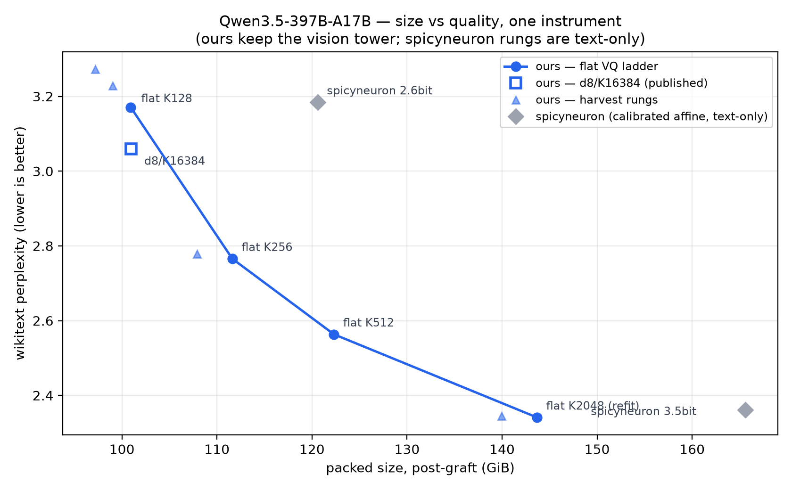
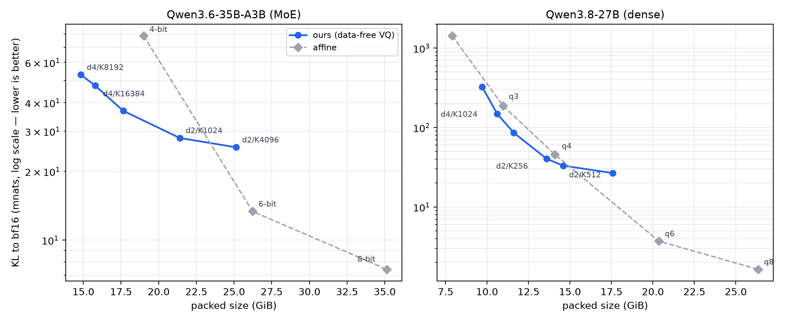

# Data-Free Vector Quantization Beats Calibrated Affine at Matched Bytes Below 6 Bits

**Noah Zelezny**

*Draft 4, 2026-08-23. Every number traces to a committed entry in the lab
record; every margin is stated against a measured fit-to-fit noise floor
for its geometry.*

## Abstract

Memory, not compute, is the binding constraint on local inference of
large language models: a model is runnable on a given machine only if
its weights fit in that machine's RAM, and for consumer and workstation
hardware — 32 to 192 GB of unified memory — this excludes, at full
precision, nearly every model approaching frontier performance. The gap is closed by quantization,
the family of techniques that store each weight in a few bits rather
than sixteen. The prevailing approach, affine quantization, rounds each
weight independently onto a uniform grid; its most refined variants tune
the grid per-channel on a calibration corpus, preserving more of the
original model per gigabyte of stored size. This paper evaluates an
alternative: **vector quantization (VQ)**, in which weights are grouped
into vectors of d consecutive values — d is the *dimension* — and each
vector is stored as an index into a *codebook*: a table of K
representative d-dimensional vectors learned by k-means over the weight
matrix itself.
Storage cost is log2(K)/d bits per weight, and the method is entirely
data-free: no calibration corpus, no activations, no teacher model.

We construct VQ quantizations of three models — Qwen3.5-397B-A17B and
Qwen3.6-35B-A3B (mixture-of-experts), and Qwen3.8-27B (dense) — and
compare them against both uniform and mixed-bit-depth calibrated affine
builds of the same models, at matched or smaller file sizes. Each model
is scored on one deterministic instrument throughout. For the two
smaller models this is KL divergence: how far the quantized model's
next-token probabilities drift from the full-precision original's,
reported in millinats (a nat is the information-theory unit taken in
the natural logarithm, as a bit is the same unit in base 2; a millinat
is a thousandth of one; zero means identical behaviour). The 397B's
full-precision teacher is too large to run on any machine we could
assemble, so that model is scored by perplexity on frozen prose and
code corpora — a measure against text rather than against the teacher.
Three findings. **First,
below approximately 5 bits per weight, the data-free VQ builds
outperform the affine builds.** On the 397B model, a 1.75-bit-per-weight
VQ build outscores the leading calibrated mixed-precision build — a
2.6-bit-per-weight artifact — on both evaluation corpora (prose and
code perplexity) while being 19.6 GiB smaller; a 2.25-bit VQ build
beats the same comparator on both corpora at near-matched size, by 24
times the measurement noise. On the 35B model, a 3.5-bit VQ build
reaches 47.5 millinats at 15.8 GiB, where the community 4-bit affine
build measures 78.6 millinats — 31.1 millinats more — at 19.0 GiB. On the dense 27B, two VQ builds straddle the 4-bit
affine conversion's size: the smaller (13.6 GiB) beats it by 12% KL
divergence while being 0.5 GiB smaller, and the larger (14.6 GiB, 3.5%
larger) beats it by 28%. The advantage has a measured boundary: on both architectures the
affine frontier overtakes VQ between 5 and 6 bits per weight, and at 8
bits affine quantization is essentially lossless, leaving nothing to
improve upon. VQ's regime is the low-bit range — which is precisely the
range in which large models fit on the hardware most people have.
**Second, model size becomes continuously tunable**: a two-coefficient
size model predicts an artifact's packed size to within a few tenths of
a GiB before it is fit — validated on all three models against builds
whose sizes were predicted before the builds existed — and
a bit-harvesting technique reaches sizes between codebook steps at
measured quality-per-byte exchange rates. **Third, weight-space
reconstruction error — the statistic most quantization pipelines
optimize and gate on — does not rank output quality in this regime.** In
a pre-registered experiment, a fitter modification engineered to improve
precisely the reconstruction statistic identified as decisive produced a
model 4.7 times worse than the one it was designed to improve. Only
evaluation of the assembled model ranks artifacts.

Comparable behaviour was observed on the gemma-4 model family, which is
nonetheless excluded from all claims: raw likelihood is not a valid
property of those instruction-tuned models, so no deterministic scoring
scheme was available. The effect is likely broader than the three models
studied; three models are what is claimed.

All artifacts are published with pinned revisions, and every comparison
names the artifact and instrument that produced it.

## 1. Introduction

The feasibility of running a large language model locally is decided primarily by
memory. Compute per token is modest for models with few active
parameters — Qwen3.5-397B-A17B, the largest model studied here,
activates 17 of its 397 billion parameters per token — but the weights
must reside in RAM regardless of how many are active, and RAM is the
commodity in shortest supply outside the datacenter. At 16-bit
precision, a machine that holds such a model is unreachable without
deliberate effort and a liberal budget. Quantization decides how low on the memory ladder a given model stays usable, and for the machines in
question the decisive band is often 2 to 6 bits per weight.

The available quantizations in this band are primarily affine: uniform
builds published by the mlx-community project, and mixed-bit-depth
calibrated builds from the community at large (for the 397B model we
compare against the most capable we could obtain, the "spicyneuron"
2.6-bit and 3.5-bit builds). To our knowledge, no
vector-quantized artifacts have been published for this software stack
at all. This paper contributes a ladder of them for each of three
models, measured against the affine incumbents at matched bytes.

**Notation.** A VQ geometry is written dN/KM, where N is the subvector
dimension and M the codebook size; builds in this paper range from
d2/K16 to d8/K16384. For example, d4/K2048 groups weights into
subvectors of 4 consecutive values and replaces each with an index into
a 2048-entry codebook, storing log2(2048)/4 = 2.75 bits per weight.
Every size in this paper is the measured size of the packed artifact on
disk; every quality number is measured on the assembled model.

The method is deliberately minimal: per-tensor k-means over the weight
subvectors, one flat codebook width across the whole surface, no data
anywhere in the loop. Data-free matters for more than elegance. A
calibrated quantizer inherits its corpus — the classic failure is
calibrating on prose and deploying on code — while a weight-space fit
has no corpus to inherit. It also forces an honest measurement posture:
when the quantizer never sees data, a quality number can only come from
scoring the assembled artifact, and §4 shows that is the only
trustworthy score anyway.

**Claim 1 (method).** At matched-or-smaller packed bytes, the data-free
VQ builds beat the affine builds — calibrated and uniform — on all
three models (§3). The claim is fenced on both ends: the wins are
measured from 1.75 to 5 bits per weight, and the crossover where the
affine frontier passes above ours is bracketed at 4.5–6.0 bits on the
dense model and 5.0–6.0 on the 35B MoE, measured from both sides in
each case. At 8 bits affine is essentially lossless and there is
nothing to beat. The quality advantage also carries a cost: VQ prefill
throughput is roughly half that of the affine builds at 35B scale
(§3.5).

**Claim 2 (size targeting).** A quantization can be tuned to a byte
budget. Codebook widths land where log2(K)/d puts them — on the 397B
the gap between adjacent widths is 31 GiB — and we make the axis
continuous: a two-coefficient size model prices any target before the
fit runs, and harvesting bits from the shallow layers, which tolerate
them, sheds size at measured exchange rates (§3.4).

**Claim 3 (measurement).** Weight-space reconstruction error does not
rank output quality here, and cannot steer design. We show this by
construction: a pre-registered intervention improved precisely the
weight-space statistic our mechanism analysis identified as the one
that mattered, and the model got worse by 4.7x the effect it was built
to fix (§4.3).

## 2. Method

The recipe has one moving part. In the mixture-of-experts models the
expert tensors hold approximately 90% of the parameters; in the dense
model the same role is played by the MLP trio — the three feed-forward
projection matrices in each transformer layer (gate, up, and down),
which together dominate a dense model's parameter count. These
byte-dominant surfaces are the quantization target. A fixed non-expert skeleton is quantized
affinely once and never varied, and the target tensors are replaced by a
vector quantization whose dial is the geometry (d, K), held flat across
every such tensor. A build is named by its geometry.

### 2.1 The skeleton

All 397B builds share one base: 6-bit structure, 4-bit attention
projections, routers kept at bf16 (cheap structure is nearly free —
demoting it 8→6 bits costs +0.0066 perplexity — while cheap routers are
catastrophic at +11). The dense 27B builds splice VQ MLPs into a 4-bit
affine conversion, carrying every other tensor through unchanged, which
makes each build a controlled ablation of the MLP treatment against its
base. The 397B's vision tower is kept at bf16 and grafted on last —
exactly 912,020,960 bytes, byte-identical across builds — and every
size is stamped as measured before or after that graft.

### 2.2 The fit

For each target tensor independently: reshape the weights into
d-dimensional subvectors, fit a K-entry codebook by k-means (k-means++
initialization, Lloyd iterations, per-group max-abs scales), store
codes and codebook. Two properties matter downstream. Healthy
reconstruction error scales with K — a fit at K=128 sits near 0.46
relative error and a healthy K=2048 fit near 0.19 — so acceptance
thresholds are set per geometry. And the initialization subsamples the
weights stochastically, so two fits of the same tensor differ; §2.6
measures the consequences and every comparison in this paper is read
against them.

### 2.3 Packing

Codes are packed to their true bit-width after fitting; packing is
bit-exact, verified at the logit level. Byte-aligned code widths are
stored directly (packing them saves nothing and costs decode speed).
All sizes are packed sizes measured on disk, and a row's size and its
quality always come from the same artifact.

### 2.4 Size targeting

Flat geometries leave gaps between rungs. To reach a size inside a gap
we harvest: hold the body geometry fixed and reduce K in the shallow
layers (the first ten, at 397B scale), which tolerate cheap bits. The
resulting size is predicted before the fit by a two-coefficient model —
at 397B, `new = base − 1.87 GiB × shallow_bits`; on the dense 27B and
the 35B, `total = code_bytes + scales + carry` with the carry measured
once per model. Out-of-sample records for both forms are in §3.4.

### 2.5 The pipeline

Every artifact passed, in order: fit → reconstruction-error gate, run
on a machine other than the one that fit it → pack → graft → structural
verification → a smoke generation through the exact runtime the
artifact ships with → scoring, both metrics, one instrument per model.
The smoke generation is load-bearing: scoring exercises a
prefill-shaped code path, serving exercises the fused decode kernels,
and an artifact can score normally while being unable to serve — so
nothing is fully validated until it has generated a token through the code
path it ships with. Predictions are registered before numbers exist,
with reading grids fixed in advance, so a wash cannot be reread
afterwards as a win.

### 2.6 Instruments and noise floors

Four quantities appear throughout. **Perplexity (ppl)** is the
exponentiated average negative log-likelihood of a fixed evaluation
text under the model — lower is better, and a quantization's quality is
read as its perplexity relative to other builds on the same text, never
across texts. **KL divergence**, reported in millinats (mnats) — a *nat* is the unit
of information measured in the natural logarithm, as a bit is in base
2, and a millinat is a thousandth of one — measures how far the quantized model's
next-token probability distribution drifts from the full-precision
model's, averaged over a fixed token stream; zero means the quantized
model behaves identically. **Top-1 agreement** is the fraction of
positions at which the quantized model's most probable token matches
the full-precision model's. **Relative reconstruction error (relerr)**
is a weight-space quantity — the norm of the difference between a
tensor and its quantized reconstruction, relative to the tensor's norm
— used only as a corruption gate, because §4.3 shows it does not rank
output quality.

**397B:** streaming referee perplexity on frozen prose and code
corpora, first 8192 tokens. Deterministic — an artifact reproduces its
total negative log-likelihood to all printed decimals across launches
and machines. **35B and 27B:** KL divergence to the bf16 model's cached
logits, in millinats, with top-1 agreement, plus referee perplexity on
the 27B. Comparator rows were re-verified on a second machine and agree
to every reported digit. The gemma-4 family, where we observed similar
size-quality behaviour, is excluded throughout: raw likelihood is
invalid on those instruction-tuned models as a property of the model
itself, scoring is therefore not deterministic, and no claim here rests
on an instrument that cannot reproduce its own numbers.

**Noise floors.** Because unseeded fits are stochastic, two builds of identical
geometry differ. We measured that spread where our comparisons live:
dense 27B d2/K256, three draws — KL range 2.085 mnats, perplexity range
0.0447; 35B d2/K1024, two draws — 0.214 mnats; 397B d4/K256, two
same-stack draws — 0.0256 prose perplexity; 397B d4/K2048, two draws —
0.0056 prose, 0.0104 code (the floor narrows as the codebook grows). The source of the width is
the stochastic initialization: across draws, mean reconstruction error
moves by 0.0001 while perplexity moves by 0.026 — the tail of the
reconstruction moves, and the tail is what output quality responds to
(§4.3). Every margin in §3 is stated as a multiple of the floor for its
geometry, a margin inside its floor is reported as noise, and a floor
is never borrowed across geometries. The dense-family fitter gained a
seed on 2026-08-22, after the measurements reported here; the MoE fitters
draw their initialization subsample unseeded by design. Every artifact in
this paper is therefore a single unseeded draw, which is why the floors
above exist and why no margin is read without one.

## 3. Results

### 3.1 Geometry: what d and K buy

Rate is log2(K)/d, so the same bit rate is reachable with small vectors
and small codebooks or large vectors and large codebooks. Measured at
matched rate, exact twins within megabytes of each other:

| rate | pair | result |
|---|---|---|
| 2.00 bpw (35B) | d4/K256 vs d2/K16 | d4 wins by 12.2% KL |
| 3.00 bpw (27B) | d4/K4096 vs d2/K64 | d4 wins by 8.6% KL |
| 1.75 bpw (397B) | d8/K16384 vs d4/K128 | d8 wins both corpora, 4.4x floor |

Dimension pays at matched rate — consistently, and modestly, with the
margin shrinking as the rate rises. It also has costs. d4 has a hard
rate ceiling of 4.0 bpw (16-bit indices over 4 weights, even at a
65,536-entry codebook), so the high bands belong to d2. And large
codebooks outgrow the GPU's fast on-chip memory: Apple's threadgroup
limit is 32 KB, a d8/K16384 codebook is 256 KB, and serving it from
device memory costs ~19% decode throughput (§3.5). The operational
sweet spots this induces: d4 with the largest codebook that fits the
band, d2 above 4 bpw, d8 where quality-per-byte justifies the decode
tax.

### 3.2 The 397B ladder

Sizes below are whole-artifact post-graft bytes: what a user downloads.
That convention is not symmetric here, and the asymmetry runs against us.
Our artifacts carry the bf16 vision tower; the community comparators are
text-only (2212 tensors, no tower), so each of our rows is 0.849 GiB
heavier than a like-for-like comparison would make it. Every size margin
we report against them is therefore understated by that amount — the
d8 build's lead is 20.4 GiB rather than 19.6, and the flagship's 22.7
rather than 21.9. We keep the download-size convention and state the
offset rather than restate the sizes, because a convention that gets
adjusted in the reporter's favour is worth less than a conservative one.

**Ours (VQ; prose / code perplexity, packed post-graft GiB):**

| build | GiB | prose | code |
|---|---|---|---|
| flat d4/K128 | 100.93 | 3.1706 | 2.6988 |
| **flat d8/K16384 (published)** | 100.97 | 3.0591 | 2.6728 |
| flat d4/K256 (published) | 111.62 | 2.7655 | 2.6383 |
| **flat d4/K512** | 122.31 | 2.5634 | 2.6123 |
| **flat d4/K2048 (published)** | 143.68 | 2.3410 | 2.5963 |

**Affine (calibrated, text-only):**

| build | GiB | prose | code |
|---|---|---|---|
| spicyneuron 2.6bit | 120.6 | 3.1843 | 2.6667 |
| spicyneuron 3.5bit | 165.6 | 2.3614 | 2.6005 |

Three comparisons carry claim 1 here. **d4/K512 against the 2.6-bit
calibrated build:** at 1.7 GiB larger, prose perplexity is better by
0.6209 — 24 times the fit-to-fit floor — and code by 0.0544. This is
the closest size-matched pair on the ladder and the least ambiguous
result in the paper. **d8/K16384 vs the same build:** at 19.6
GiB smaller, prose is better by 0.1252 (4.9x floor). **d4/K2048 vs the
3.5-bit calibrated build:** 21.9 GiB smaller, with better prose
perplexity by 0.0204 — 3.6 times this geometry's measured fit-to-fit
floor of 0.0056 — and a code margin of 0.0042 that sits inside the
0.0104 code floor and is reported as a tie. The claim is therefore:
smaller by 21.9 GiB, better on prose, tied on code — and 22.7 GiB
smaller on the like-for-like basis described above.

Our ladder is monotone — no mixed-allocation build beats the flat rung
at or above its own size, and a matched-byte sweep of allocation shapes
at identical 141.42 GiB spanned 0.32 perplexity with flat winning —
which is why flat rungs are the reference points and mixed allocation
is a size-targeting tool (§3.4), not a quality one.

### 3.3 The 35B MoE and the dense 27B

**35B — ours (VQ):**

| build | GiB | KL mnats | top-1 |
|---|---|---|---|
| d4/K8192 | 15.67 | 53.02 | 89.55% |
| **d4/K16384** | 16.61 | 47.54 | 89.81% |
| d2/K256 | 18.48 | 36.86 | 90.92% |
| **d2/K1024** | 22.23 | 28.14 | 92.22% |
| d2/K4096 | 25.98 | 25.50 | 92.52% |

**35B — affine:**

| build | GiB | KL mnats | top-1 |
|---|---|---|---|
| 4-bit (community) | 19.00 | 78.56 | 85.61% |
| 6-bit (ours) | 27.07 | 13.36 | 94.65% |
| 8-bit (community) | 35.13 | 7.45 | 96.18% |

Every 35B size above includes the 333-tensor bf16 vision tower, which the
community comparators ship and our builds now carry: 0.832 GiB,
byte-identical across builds, unquantized in all of them. All rows are
measured post-graft except d2/K256, which is its measured packed size plus
that constant. Comparisons here are therefore like-for-like at face value.
(The 397B in §3.2 sits the other way round: our builds carry a tower its
comparators lack, which is why that section states an offset rather than
applying one.)

At the small end VQ dominates: 47.5 mnats at 16.6 GiB against affine's
78.6 at 19.0 — 39% less divergence in 2.4 GiB fewer bytes. At 5 bits
per weight the comparison becomes a placement rather than a dominance:
d2/K1024 lands between two affine rungs, and two independent fits of it
score 28.14 and 27.93 against 38.7 for the affine frontier
log-interpolated to the same size — both draws a factor of ~1.4 below
the line, roughly 50x the draw floor. One rung higher the sign flips: at 6 bpw,
d2/K4096 is 1.1 GiB smaller than the 6-bit affine build and scores
1.91x worse — 57x the floor, conclusive. (That two "6-bit" artifacts
differ by 1.1 GiB is expected: a nominal rate names the code width on
the quantized surface, while total bytes include each method's scale
overhead and its treatment of the non-expert remainder — which is why
every comparison in this paper is by measured size, never by nominal
rate.) **The crossover on this family
sits between 5.0 and 6.0 bits per weight.**

**27B — ours (VQ):**

| build | GiB | KL mnats | top-1 | ppl |
|---|---|---|---|---|
| d4/K256 | 9.7 | 325.6 | 76.5% | 6.403 |
| **d4/K1024** | 10.61 | 148.5 | 82.5% | 5.525 |
| d4/K4096 | 11.61 | 85.8 | 86.1% | 5.229 |
| **d2/K256** | 13.60 | 40.3 | 90.1% | 5.233 |
| **d2/K512** | 14.59 | 33.1 | 91.1% | 5.194 |
| d2/K4096 | 17.58 | 26.7 | 91.7% | 5.242 |

**27B — affine.** No MLX-format quantization of this model has been
published by the community, so unlike the 397B and 35B comparators these
rungs are our own conversions. That is a weaker class of evidence — a
comparator one builds oneself can be built badly — and one such flaw is
recorded in §4.1.

| build | GiB | KL mnats | top-1 | ppl |
|---|---|---|---|---|
| q2 | 7.9 | 1426.9 | 46.1% | 16.435 |
| q3 | 10.96 | 187.8 | 79.5% | 5.832 |
| q4 | 14.09 | 45.8 | 89.8% | 5.206 |
| q6 | 20.36 | 3.71 | 96.8% | 5.260 |
| q8 | 26.34 | 1.64 | 98.1% | 5.243 |

The recipe is not an MoE phenomenon. Below 4.5 bpw every VQ point sits
above the affine line at its size: d4/K1024 beats q3 on both metrics at
0.35 GiB less, and d2/K512 beats q4 by 27.8% KL (6.1x floor) and +1.28
points top-1 at q4-class size. Above, the picture inverts: q6 beats our
best 6-bpw rung by 7.2x KL at 2.8 GiB more. **The dense crossover is
bracketed at 4.5–6.0 bpw — nearly the same band as the MoE.** One
instrument note: the perplexity column barely moves from q3 upward
(5.19–5.35, all inside the 0.0447 floor) while KL moves 40x. On this
instruction-tuned family, perplexity cannot rank quantizations;
divergence and agreement can.

### 3.4 Size targeting

The size models' out-of-sample record: at 397B, six hits and one
in-band across seven predictions (worst miss 0.4 GiB, best +0.02); on
the 35B, three consecutive geometry predictions at −0.03%, −0.30% and
−0.37%; on the dense 27B, three builds across two geometries within
0.003 GiB. Pricing a build before fitting it works on every model we
tried it on.

Harvest exchange rates, measured at three base richnesses on the 397B
(prose perplexity per GiB shed): 0.0315 from a K128 base, 0.0033 from
K256, 0.0011 from K2048 — the cost falls ~30x as the base gets richer,
and is roughly half the cost of stepping down the flat ladder. The
fence: harvest cost is monotone at every base measured, and no harvest
build beats the flat rung at the flat rung's own size. What harvest
buys is the sizes in between. Together with the size model, the
capability is: name a byte budget, price the build, fit it once.

### 3.5 Runtime performance and kernel support

None of this serves without custom Metal kernels: a fused
decode-and-matmul path that reads codes and codebook directly (per-K
bit-width extraction in-kernel), a device-memory codebook variant for
the codebooks that exceed Apple's 32 KB threadgroup memory, and a
zero-copy view that dispatches byte-aligned unpacked codes through the
packed kernel (+25–33% prefill, bit-exact). All kernel variants are
accepted only on bit-identity with a reference path where both load,
and on relative error against a float32 reference where only one does.

Decode throughput is equivalent across the d4 geometries, whose
codebooks fit in threadgroup memory. It is not equivalent where they do
not: d8/K16384's 256 KB codebook streams from device
memory and costs approximately 19% of decode throughput against its
same-size d4 sibling — the measured price of the quality its geometry
buys, and one that may differ on hardware with a different memory
hierarchy. Against affine,
VQ prefill remains ~0.5x at 35B scale even after the zero-copy lever;
decode is within 10–20%. Speed numbers here are same-session ratios
between arms: we found decode throughput at ~100 GiB residency to be
bimodal on our hardware (the same artifact varying 40% run to run, with
swap, thermals and storage path each ruled out by measurement), we have
not characterized other sizes, and we therefore publish no absolute
throughput figures.

## 4. Negative results

This section reports what did not work, what cannot be reached, and
what those boundaries imply. They are results, not caveats: each was
measured, and several bound the claims of §3.

### 4.1 The 8-bit ceiling

At 8 bits affine is essentially lossless: 7.4 mnats on the 35B, 1.6 on
the 27B. The 35B figure comes from a community 8-bit whose quantized
surface matches its 4-bit sibling exactly. The 27B figure comes from our
own conversion, which leaves 96 linear-attention projections at bf16 that
its 4-bit sibling quantizes — 23.6 M parameters, 0.09% of the model, a
0.02 GiB difference in the artifact. This is a defect in our conversion
rather than a property of the format: a community 8-bit build of the
neighbouring model in the same family, with the same attention
structure, quantizes those modules. The direction matters more than the
magnitude: leaving those tensors unquantized makes the 8-bit bar better
than a uniform 8-bit would be, which flatters affine and therefore
flatters our own negative result. We report it for that reason. It does
not change the finding — the tensors are counted in the size, and the
27B gap is roughly 25 bits per weight, so no plausible correction to a
near-lossless divergence closes it — but a bar that errs in the
direction of one's own conclusion should be named by the person who
built it. Nothing we measured approaches that under the byte budgets
where VQ wins. On the 27B, the ladder's own slope says why: divergence
falls by x0.673 per added bit near 4.5 bpw but only x0.868 per bit by
6.0 — extrapolating the measured slope, 8-bit-class quality needs ~25
bits per weight. The 35B agrees from the other side: a 6-bit affine
build inside a 28 GiB budget misses 8-bit quality by 1.8x, and our
5-bit build misses it by 3.8x. On both models, 8-bit quality costs 8-bit bytes, for affine and for
VQ alike.

### 4.2 Where the geometry axes stop paying

Dimension pays at matched rate (§3.1) but the margin shrinks as rate
rises — 12.2% at 2.0 bpw, 8.6% at 3.0 — and at 4.0 bpw it stops paying
cleanly. A d4/K65536 rung matched against a d2/K256 rung of the same
size splits: divergence favours d4 by 2.2 mnats, which is 1.06 times a
floor measured at a different geometry and so not a margin we read,
while perplexity favours d2 by 0.078, or 1.75 times that same borrowed
floor. Neither pre-registered branch fired; the honest reading is a
wash leaning d2, and the dimension advantage is not established above
3 bpw. Codebook size pays with the expected
diminishing returns: on the 35B d4 line, each doubling of K buys less
(17.0, then 12.1, then 5.5 mnats). Harvest never beats the flat rung at
its own size, at any base richness we measured; its value is
reachability, not quality. And calibration lost on its home turf where
we tested it: an activation-calibrated method fell to uniform
quantization on the dense 27B, and per-layer sensitivity probes rank
layers in ways that do not survive contact with assembled-model scores
on MoE.

### 4.3 Reconstruction error cannot steer design

The central negative, shown by construction. A refit of one published
geometry scored worse than the original at byte-identical size while
having *lower* reconstruction error on every projection. Percentile
analysis located the trade: the refit was better where most weights
live and worse precisely in the top 0.1% by magnitude — and mean
reconstruction error, a bulk statistic, reported the trade as an
improvement. The mechanism replicated across 36 tensors and has a
clean cause: body-layer weights are sub-Gaussian, so a
better-average-distortion codebook is bought from the tail, and the
tail is what output quality responds to.

So we engineered the converse as a designed test, pre-registering the
reading before any number existed: reweight the k-means objective to
recover exactly that tail band. It worked in weight space — the tail
error bands improved as designed — **and the resulting model was 4.7 times worse than
the regression the change was designed to repair.** At fine-grained fits the two
metrics track (improving the objective at a 0.08-relative-error
geometry improved the model, 2.8x the floor); where centroids are
scarce they invert; and no weight-space statistic we measured predicts
which side of that line a fit lands on. Only the assembled model knows.

Two scope notes. These comparisons are between arms sharing the same
base and differing only in the fitter, so base-vintage differences do
not touch them. And the same phenomenon sets the fit-to-fit noise
floors of §2.6: across stochastic draws, mean reconstruction error is
essentially constant while output quality moves by more than several
margins we had been prepared to report. Any comparison at that scale is
a comparison of draws.

### 4.4 Levers that do not exist

Speed levers we tested and closed: a fused row-gather for prefill (the
runtime already fuses it; recoverable ~zero), byte-aligned packing (
saves zero bytes, costs 37% decode — packers now skip it), native-bf16
kernel execution (same speed, changes numerics). Distillation-based
refinement at 397B/2-bit was falsified outright. Each carries a
measured effect size in the lab record.

## 5. Keeping the data clean

Every number above survived a set of rules that exist because, across
two weeks and roughly 140 logged experiments, no wrong number ever
announced itself — each looked plausible and was caught only by a
mechanical check. The rules are the reusable part:

**Pre-register the reading, then the number.** Predictions are written
before fitting or scoring, with a reading grid fixed in advance —
including what a wash would mean — and falsified predictions are
recorded as falsified, never reframed.

**Measure the noise floor before believing a margin.** Stochastic fits
give identical-geometry builds a measurable spread (§2.6). A margin is
quoted as a multiple of the floor for its own geometry; floors are
never borrowed across geometries; a margin inside its floor is noise
regardless of its direction. One additional fit per geometry provides
the floor, and applying the rule retrospectively retired three of this
paper's own candidate claims.

**A comparison row names the artifact and instrument that produced
it.** A number older than the artifact it faces is re-measured, not
cited. A row's size and quality come from the same artifact. Sizes are
packed bytes on disk; analytic estimates are labeled as estimates.

**Score only gated artifacts, and gate on a different machine.** A
corrupt artifact scores plausibly, and a fitter's own log cannot see
what reached disk.

**A gate must fail on a known-bad input and pass on a known-good one
before its verdict is trusted.** A checker that cannot fail certifies
nothing; a probe must also record what it actually exercised, and
report itself vacuous when the two arms it compares resolve to the
same code.

**Serve a token before shipping.** Scoring and serving exercise
different code paths; an artifact can score perfectly and be unable to
generate. Nothing is validated or releasable until it has generated through the exact
runtime it ships with, on a machine configured like a user's.

**Provenance is physical.** Build inputs get manifests — per-shard
bytes, mtime, and a hash of each shard's head, stored outside the
artifact — because a file silently rewritten in place is otherwise
indistinguishable from the original, a failure mode observed twice in
this project. The stamp is deliberately described as what it is: it
identifies a shard and catches a rewrite, but it does not certify every
byte, and mtimes survive copying. Metadata answers *was this replaced*,
never *is this unchanged*.

**A label is not a measurement.** Metadata records what someone
intended, not what the file contains. Every checkpoint in this project
declares a `model_type` naming the wrong model release, carried forward
silently into each derived build; we came close to grafting one model's
vision tower onto another on the strength of that field. Our own
descriptions failed the same way — a manifest documented as storing
content hashes stores a hash of each shard's head, and a fitter
documented as seeded was not seeded. None of these survived because they
were hard to check. They survived because they were trivial to check, and
nothing that costs nothing to believe ever gets a verification budget.
Where a property carries a claim, it is read from the bytes: a tensor
compared against its candidate base, a hash recomputed, a flag traced to
the line that consumes it.

None of this is novel methodology; it is ordinary unit discipline,
applied to a setting where the wrong numbers are the plausible ones.

## 6. Limitations

**Coverage.** Three models from one vendor family, only one of them
dense; a second dense model would test whether the 27B generalizes.
(The gemma-4 family showed similar behaviour but cannot be scored
deterministically and is excluded.) Single software stack (MLX/Metal);
the kernel conclusions — threadgroup capacity, the d8 decode tax — are
specific to Apple Silicon.

**Unmeasured regions.** The VQ/affine crossover is bracketed on the
35B and the 27B, but not on the 397B: affine builds above 3.5 bits
exist or could be produced for that model, but at ~225 GB for a 4-bit
build and ~320 GB for 6-bit they exceed the memory of any machine
available to this project, so whether the same crossover band holds at
that scale is untested. Whether dimension still pays at d4's 4.0 bpw
ceiling is a rate-twin experiment currently fitting. No dense harvest
rung has been built: claim 2's exchange rates are measured on MoE
only, and the mechanism we propose (shallow-layer redundancy) predicts
they should weaken on dense — a prediction, not a result.

**Instrument limits.** The 397B noise floors rest on two draws per
geometry (0.0256 prose at d4/K256; 0.0056 prose and 0.0104 code at
d4/K2048 — the floor narrows substantially as the codebook grows). The 35B floor bounds initialization variance only
(same box, same geometry). Perplexity cannot rank quantizations on the
instruction-tuned 27B (§3.3). Decode throughput was bimodal at ~100
GiB residency on our 128 GB machine and is uncharacterized at other
sizes; we publish ratios within a session, never absolutes.

**Costs we pay.** Prefill remains ~0.5x affine at 35B scale even after
the shipped lever. Codebooks beyond threadgroup capacity pay ~19%
decode. One published artifact cannot be rebuilt at all — it predates
the manifests and its build inputs were later overwritten — though
it remains downloadable, its scores reproduce exactly, and its quality
is consistent with the measured draw distribution of its geometry.

## 7. Reproducibility

All artifacts are published under `TheDrainFlorist` on Hugging Face
with their VQ runtimes bundled in-checkpoint (stock mlx-lm, no
patches). Where a repository's weights were upgraded in place, the
previous build remains fetchable at its pinned revision and the card
labels which weights produced which benchmark rows. Published
artifacts carry external manifests. The fits behind them are unseeded
single draws, so a published build is reproducible in recipe and
geometry but not bit-for-bit; that is precisely why every margin in this
paper is quoted against a measured fit-to-fit floor rather than against
a repeated build. The dense-family fitter has since gained a seed.

Which copy of a runtime executes is environment-dependent, so
runtime-dependent claims name the resolved, executing copy rather than
a file believed to be loaded. The bundled runtimes here are verified
three ways: hash-compared against the runtime that produced the
published scores, exercised as the executing copy in a stock
environment by generating through the shipping kernel, and passed
kernel acceptance as the unit under test lifted from the artifact
itself. Fit, pack, verify, gate and scoring scripts are in the project
repository, and the referee corpora ship with it (nothing was fit on
data, so there is no train/eval overlap to disclose).

## Acknowledgments

The spicyneuron and mlx-community builds served as comparators
throughout; this work exists because those artifacts were public,
pinned, and worth measuring against. We hope ours are the same.

**AI disclosure.** The experiments in this work were executed with
substantial assistance from large language model agents (Anthropic
Claude, Opus and Sonnet-class models), which operated the fitting,
packing, verification, and scoring pipelines under the author's
direction, and assisted in drafting this manuscript. All quantitative
results were produced by the deterministic instruments described in
§2.6, are traceable to a committed laboratory record, and were verified
independently of any model-generated summary. The author directed all
experiments, made all methodological decisions, and takes sole
responsibility for the content.
